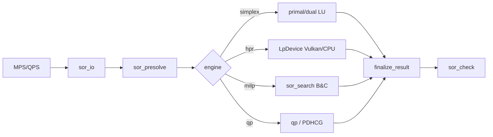
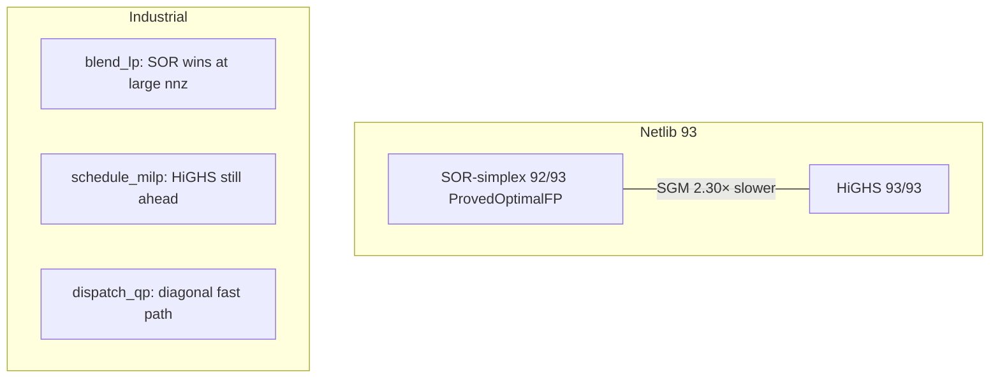

# SIH 2026 — Idea PPT copy

**Use this file as speaker notes + slide text.** One `## Slide` = one PPT slide.  
Portal typos stay out of spoken lines: **Express = FICO Xpress**, **CEPLEX = IBM ILOG CPLEX**.

Product: **SOR** (Sovereign Optimization Runtime)  
PS: **SIH26119** · MRPL · Software · Smart Automation

**Numbers below verified from** `benchmarks/results/FULL_PERF_HIGHS_20260904-070105.md`  
(Netlib `compare-netlib-20260904-070105`, industrial `industrial-perf-20260904-071353`, MIPLIB `compare-new-all-20260904-072056`).  
Re-run the day you freeze the PDF and replace Slide 8 if they moved.

Code truth: `docs/architecture.md`. PS map: `docs/SIH26119_PS_ALIGNMENT.md`.

---

## Slide 1 — Title

**SMART INDIA HACKATHON 2026**

| | |
|---|---|
| **Problem Statement ID** | SIH26119 |
| **Problem Statement Title** | Indigenous GPU-Accelerated Optimization Solver (Sovereign Alternative to Xpress / CPLEX) |
| **Theme** | Smart Automation |
| **Category** | Software |
| **Organization** | Mangalore Refinery and Petrochemicals Limited (MRPL) |
| **Team** | Point Blank |
| **Product** | SOR — Sovereign Optimization Runtime |

Footer: GitHub source · Demo video

---

## Slide 2 — Idea / Approach

**One line:** A from-scratch LP + MILP + QP engine — no foreign solver library in the binary, sparse numerics, honest proofs, CLI, public benchmarks, GPU where transfer-inclusive time wins.

**Problem:** Refinery scheduling, blending, planning, logistics, and dispatch depend on CPLEX, Gurobi, and Xpress. High recurring licenses, closed internals, no sovereign control. Open solvers exist but still lag on hard large-scale MILP. The work is the **engine**, not a GUI.

**Approach — four layers (what the code actually has)**

1. **Sparse LP core** — revised primal + dual simplex, Markowitz LU, Harris / BFRT, Devex/DSE, Ruiz scaling, v1 presolve; FT update opt-in
2. **MILP search** — branch-and-cut (root GMI), reliability branching + strong probes, dive / neighbourhood, domain propagation
3. **Convex QP** — sparse symmetric Q + PDHCG path; diagonal active-set fast path for dispatch
4. **GPU first-order path** — Vulkan `LpDevice` HPR (6 SPIR-V shaders); timings include host↔device transfer

**Interfaces:** CLI (`sor_solve`, `sor_check`, `sor_gen`) and C++ libraries. Polished GUI is out of scope (PS).

**Guarantee:** `Optimal` only via `finalize_result()` after residual / proof gating. Independent `sor_check` re-verifies against the original model.

**Non-claims:** not a PIMS plugin; not confidential MRPL data; not “faster than CPLEX/Gurobi” in general; not VIPR/rational certified yet.

---

## Slide 3 — Methodology (flow)

```text
INPUT  MPS / QPS / C++ API
              │
              ▼
     Model  →  Presolve (v1) + Ruiz scaling
              │
     ┌────────┼────────────────┐
     ▼        ▼                ▼
    LP       QP              MILP
  primal /  active-set /    Branch-and-Cut
  dual      PDHCG           root GMI · heuristics
  simplex                   reliability branch
  + HPR (CPU/Vulkan)        · propagation
     │        │                │
     └────────┴────────┬───────┘
                       ▼
              Sparse LU (CPU) — proof engine
              GPU FO — approximate path (no crossover yet)
                       ▼
              Unscale + postsolve
                       ▼
              finalize_result  →  Status + ProofLevel
                       ▼
              sor_check (independent residuals / Farkas)
```



**Clean-room:** built from mathematical papers, not by linking or translating HiGHS / SCIP / CBC / cuOpt. Those solvers run only as **external processes** for comparison.

---

## Slide 4 — Tech stack (verified)

| Layer | Choice (in tree) |
|---|---|
| Language / build | C++20, CMake |
| GPU | Vulkan + SPIR-V (`LpDevice`); CUDA stub returns null; optional Julia sidecar OFF by default |
| Linear algebra | CSR/CSC, Markowitz sparse LU, hypersparse FTRAN/BTRAN, product-form default + Forrest–Tomlin opt-in |
| LP | Primal + dual revised simplex (Harris, BFRT, Devex, DSE), HPR / PDHG |
| MILP | B&B + **root** GMI cuts, reliability branching, dive / neighbourhood, propagation |
| QP | Convex sparse symmetric Hessian; diagonal active-set fast path |
| I/O | MPS, QPS, solution files |
| Front ends | `sor_solve` · `sor_check` · `sor_gen` · `sor_ext_demo` |
| Benchmarks | Netlib, MIPLIB-easy, industrial generators vs **HiGHS (external)** |

`ldd sor_solve` (Vulkan ON): `libvulkan` + libstdc++ / libm / libgcc / libc — **no solver library**.

---

## Slide 5 — Solver layers (what each does)

**LP**  
Revised simplex on sparse bases. Dual simplex for MIP node LPs (warm start). Harris ratio test + dual bound-flipping. Devex / dual steepest-edge. Ruiz scaling. Presolve + postsolve. FT available via `--basis-update ft`.

**MILP**  
Root cutting-plane loop (Gomory MI + pool). Reliability branching with strong-branch probes. Rounding repair, integer dive, neighbourhood search. Domain propagation. Relative MIP-gap termination. Honest `Feasible` vs proved `Optimal`.

**QP**  
Convex quadratic with sparse symmetric PSD Hessian. PSD, stationarity, feasibility and Wolfe-gap checks gate `Optimal`; diagonal dispatch uses an exact active-set fast path.

**GPU**  
Device owns HPR iterates. Host calls fused first-order steps. Report kernel time **and** H2D/D2H. Sparse simplex pivoting stays on CPU (that is where proofs live). No FO→basis crossover yet → FO cannot claim `ProvedOptimalFP`.

**Robustness**  
Farkas check for infeasibility. Status ladder includes `NumericalFailure` and `Unsupported` — never hide a miss as Optimal.

---

## Slide 6 — Working model

```text
sor_gen  →  blend LP / schedule MILP / dispatch QP   (seeded, public recipes)
                 │
                 ▼
sor_solve MODEL.mps
    --engine simplex | hpr | milp | qp
    --backend cpu | vulkan
    --method auto | primal | dual
    --basis-update product | ft
    --solution-out out.sol
                 │
                 ▼
status · proof_level · objective · timings
                 │
                 ▼
sor_check MODEL.mps out.sol     independent residuals / Farkas
```

**Live demo (2–3 min)**

1. Blend LP → Optimal, objective matches HiGHS  
2. Small MIPLIB MILP → incumbent + gap (say Feasible honestly when not proved)  
3. Dispatch QP → Optimal  
4. Same LP on Vulkan HPR with transfer table  
5. `sor_check` on the written solution  

---

## Slide 7 — Prototype

**Left:** CLI — `sor_solve` on an MPS; status, proof level, objective.  
**Right:** GPU — `--backend vulkan --engine hpr` with transfer stats.

Screenshot placeholders:

- Terminal: Netlib / blend solve  
- Terminal: `sor_check` PASS  
- Repo tree: `sor_engines` · `sor_search` · `sor_la_cpu` · `sor_backend/vulkan`

---

## Slide 8 — Prototype output (measured 4 Sep 2026)

**Source:** `FULL_PERF_HIGHS_20260904-070105` · host `yash-Bravo-15-B5DD` · HiGHS external only.

### Netlib LP — 93 instances, 30 s limit

| Solver | Solved | Obj match | SGM time |
|---|---:|---:|---:|
| **SOR-simplex** | **92/93** | **92/93** | **0.2085 s** |
| SOR-pdhg | 8/93 | 28/93 | 0.3598 s |
| SOR-hpr | 17/93 | 33/93 | 0.5569 s |
| HiGHS | 93/93 | 93/93 | **0.0905 s** |

- **92/93** carry `ProvedOptimalFP` (every Optimal instance).  
- Honest line: ~**2.30×** slower SGM than HiGHS on this set; **0 objective disagreements** on the 92 solved.  
- Miss: `dfl001` — `Interrupted` at 30 s (HiGHS Optimal in ~5.2 s).

### Industrial generators (seed 42, 120 s) — highlights

| Kind | Result |
|---|---|
| blend_lp S→HUGE | All Optimal, obj agrees; SOR **faster** from L–HUGE (HUGE **4.29×** vs HiGHS) |
| schedule_milp S→HUGE | All Optimal, obj agrees; SOR slower at scale (HUGE **0.03×**) — say the gap |
| dispatch_qp S→XL | Optimal + agree; large diagonal path much faster than HiGHS-QP |
| dispatch_qp XXL/HUGE | SOR Optimal; HiGHS timed out — obj agree flagged False (honest) |

### MIPLIB-easy + demos (23 instances, 30 s)

| Metric | Value |
|---|---|
| Incumbent coverage | **23/23** (10 Optimal · 13 Feasible) |
| Proved Optimal (examples) | `blend2`, `enigma`, `flugpl`, `mod010`, `p0033`, `p0201`, `rgn` + demos |
| Message | Many still **Feasible, not proved** — say that out loud |

**Baseline:** HiGHS as external process — satisfies “compare vs ≥1 open solver.”



---

## Slide 9 — Feasibility and viability

**PS success criteria**

1. From-scratch core (no solver library in the link graph) — **met**  
2. LP, MILP, QP on public libraries — **vertical slices met**  
3. Robustness: degeneracy, ill-conditioning, weak MIP relaxations — **algorithms present; keep demoing**  
4. Basic API **or** CLI — **CLI met**  
5. GPU **where transfer-inclusive time improves** — **Vulkan path exists; show win + non-win**

**Why it is feasible**  
Vertical slice already solves real Netlib LPs (92/93 proved) and industrial blend LPs (SOR faster at large nnz). Architecture is modular. Clean-room is checkable (`ldd`, CMake, policy doc).

**Named risks**  
MILP still trails HiGHS on large schedules. GPU ceiling is memory-bandwidth on this RDNA1 laptop. Million-variable **proved** MIP is not an SIH claim. No crossover yet for FO proofs.

---

## Slide 10 — Impact and benefits

**Impact**  
Sovereign optimization engine for refining, blending, planning, logistics, and power dispatch — inspectable, tunable, no foreign license in the solve path.

**Benefits**

- License independence for PSU-scale LP / MILP / QP  
- Independent residual checker for high-stakes decisions  
- Public industrial recipes (no confidential plant data)  
- GPU for large sparse **continuous** LPs; simplex remains the proof engine  

**Adoption**  
MPS / CLI / native C++ libs. Not a replacement for Aspen PIMS; not a PIMS plugin.

Do **not** invent an MRPL rupee license figure.

---

## Slide 11 — Research and references

**Purpose:** credibility + resource hub (not a dry bibliography). Judges see *where ideas came from* and get *one-tap access* to evidence.

```text
┌──────────────────────────────────────────────────────────────────────────┐
│  Point Blank                          RESEARCH AND REFERENCES    SIH 2026│
├────────────────────────────────────────────┬─────────────────────────────┤
│  MAIN LIST (7 rows, alt. blue / green)     │                             │
│                                            │      ┌─────────────┐        │
│  1  Huangfu & Hall (2018)                  │      │             │        │
│     Dual revised simplex / PAMI blueprint  │      │   QR CODE   │        │
│                                            │      │             │        │
│  2  Forrest–Tomlin (1972) · Hall–McKinnon  │      └─────────────┘        │
│     (2005) — FT update + hypersparse LA    │                             │
│                                            │   Try out SOR HERE          │
│  3  Koberstein / Koberstein–Suhl           │   (hosted CLI / web console)│
│     Dual BFRT + dual phase 1               │                             │
│                                            │                             │
│  4  HPR-LP — Chen et al. (MPC 2025)        │                             │
│     Halpern Peaceman–Rachford GPU FO LP    │                             │
│     arXiv:2408.12179                       │                             │
│                                            │                             │
│  5  cuPDLPx — Lu, Peng, Yang (2025)        │                             │
│     Restart + PID primal weight            │                             │
│     arXiv:2507.14051                       │                             │
│                                            │                             │
│  6  Achterberg (2007) + Andersen–Andersen  │                             │
│     Branch-and-cut · LP/MILP presolve      │                             │
│                                            │                             │
│  7  Netlib · MIPLIB 2017 · Mittelmann      │                             │
│     Public benchmarks (independent oracle) │                             │
├────────────────────────────────────────────┴─────────────────────────────┤
│  DELIVERABLES (four equal tiles)                                         │
│                                                                          │
│  Paper Index          GitHub Source         Hosted Demo       Whitepaper │
│  paper_bibliography   (SOR clean-room)      Try SOR HERE      PS align + │
│  · arXiv DOIs         no HiGHS/SCIP/cuOpt   CLI / web console architecture│
│                                                                          │
│  note under GitHub: “From-scratch LP·MILP·QP · Vulkan HPR”               │
├──────────────────────────────────────────────────────────────────────────┤
│                                                              page · 11   │
└──────────────────────────────────────────────────────────────────────────┘
```

### Layout notes (match OAAS demo slide)

| Zone | Content |
|------|---------|
| **Header** | Left: **Point Blank** · Center: **RESEARCH AND REFERENCES** · Right: **SIH 2026** logo |
| **Left list** | 7 alternating rows (light blue / green) — papers + benchmark community, not only authors |
| **Right CTA** | Large QR → hosted demo URL · caption **“Try out SOR HERE.”** |
| **Bottom strip** | 4 links: Paper Index → GitHub → Hosted Demo → Whitepaper |
| **Footer** | Page **11** bottom-right |

### Visual hierarchy (judge eye path)

```text
RESEARCH AND REFERENCES
        ↓
 Sources / papers / benchmarks  ←→  QR / live demo
        ↓
 Paper Index | GitHub | Hosted Demo | Whitepaper
```

Three layers:

1. **Credibility** — peer-reviewed simplex + HPR/GPU FO foundations  
2. **Demonstration** — QR to try SOR  
3. **Verification** — bibliography, source, live system, write-up  

### Paste URLs before freeze

| Tile | Placeholder |
|------|-------------|
| QR / Hosted Demo | `https://<your-hosted-sor-demo>` |
| GitHub Source | `https://github.com/<org>/sor` |
| Paper Index | repo `docs/paper_bibliography.md` (or raw GitHub URL) |
| Whitepaper | `docs/SIH26119_PS_ALIGNMENT.md` + `docs/architecture.md` (or PDF export) |

### Speaker one-liner

> “We did not wrap HiGHS. Every major technique has a paper; you can scan the QR to run the same CLI judges will see, then open the repo and the paper index.”

---

# Appendix A — Optional extra slides

## Extra slide — System architecture (one diagram)

```text
L8  sor_solve · sor_check · sor_gen
L7  sor_certify (finalize_result)
L5  sor_search  (B&C, cuts, propagate)
L4  sor_engines (simplex, dual, PDHG, HPR, QP)
L3  sor_presolve
L2  sor_model · sor_io
L1  sor_sparse · sor_la_cpu · sor_backend (+ Vulkan)
L0  sor_core    (Status · ProofLevel)
```

## Extra slide — PS coverage map

| PS demand | What we show |
|---|---|
| From scratch | `ldd` / no HiGHS-SCIP-CBC-cuOpt in the binary |
| LP | Netlib 92/93 ProvedOptimalFP vs HiGHS |
| MILP | MIPLIB-easy + B&C (honest Feasible count) |
| QP | Dispatch / QPS path |
| Sparse + robust LA | Markowitz LU, Harris, BFRT, hypersparse, FT opt-in |
| CLI | `sor_solve` / `sor_check` / `sor_gen` |
| Industrial class | `sor_gen` blend / schedule / dispatch |
| GPU if measurable | Vulkan HPR; transfer included; win **and** non-win |

## Extra slide — What we will not claim

- Faster than CPLEX / Gurobi / Xpress in general  
- Million-variable MILP proved optimal  
- GPU accelerates every problem class  
- VIPR / rational-exact / crossover (not built)  
- Confidential MRPL data  
- A rupee figure for Indian PSU solver spend  

---

# Appendix B — Gaps (internal freeze list)

Do not put unimplemented rows on public slides as “done.”

| Item | Today (verified) | Before claiming “done” |
|---|---|---|
| MILP at scale | Root B&C; trails HiGHS on large schedules | Node cuts, stronger incumbents |
| FO proofs | HPR/PDHG Feasible only | Crossover → ProvedOptimalFP |
| FT default | Implemented, opt-in (`--basis-update ft`) | Enable after Netlib/MIPLIB gate |
| Collective FT | `collapse_pending_into_ft` opt-in | Default-on after gate; full APF still open |
| Hypersparse story | Reach-set + identity-eta skip in tree | Publish FT-default + large-sparse timing story |
| GPU benefit table | Vulkan exists | Published CPU vs Vulkan HPR with H2D/D2H |
| `sor_verify` / VIPR | Enums only | Separate binary, no engine link |
| CI `check_*` scripts | Missing | Forbidden-deps / layering / determinism gates |
| QPLIB table | Thin | Named subset vs HiGHS |

**Not required for SIH:** GUI · modelling language · confidential plant data · beating CPLEX · NLP/MINLP as delivery · AI/ML branching

---

# Appendix C — Spoken 60-second pitch

India’s refineries and grids optimize with closed foreign solvers. We are building **SOR**: a from-scratch LP, MILP, and QP engine — sparse simplex for proofs (92 of 93 Netlib instances proved Optimal against HiGHS), first-order methods on Vulkan where transfer-inclusive time wins, branch-and-cut for integers, CLI plus an independent checker. We compare honestly to HiGHS. We do not wrap an open solver, we do not fake Optimal, and we do not claim we beat CPLEX. The product is a sovereign engine MRPL-class problems can actually call.
