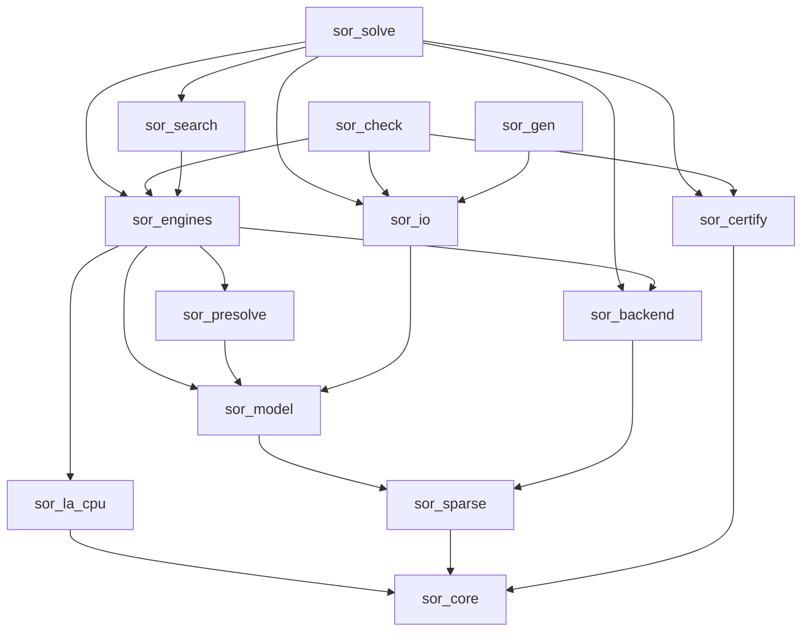
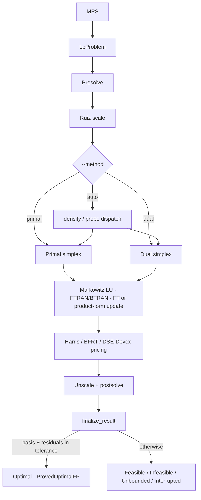
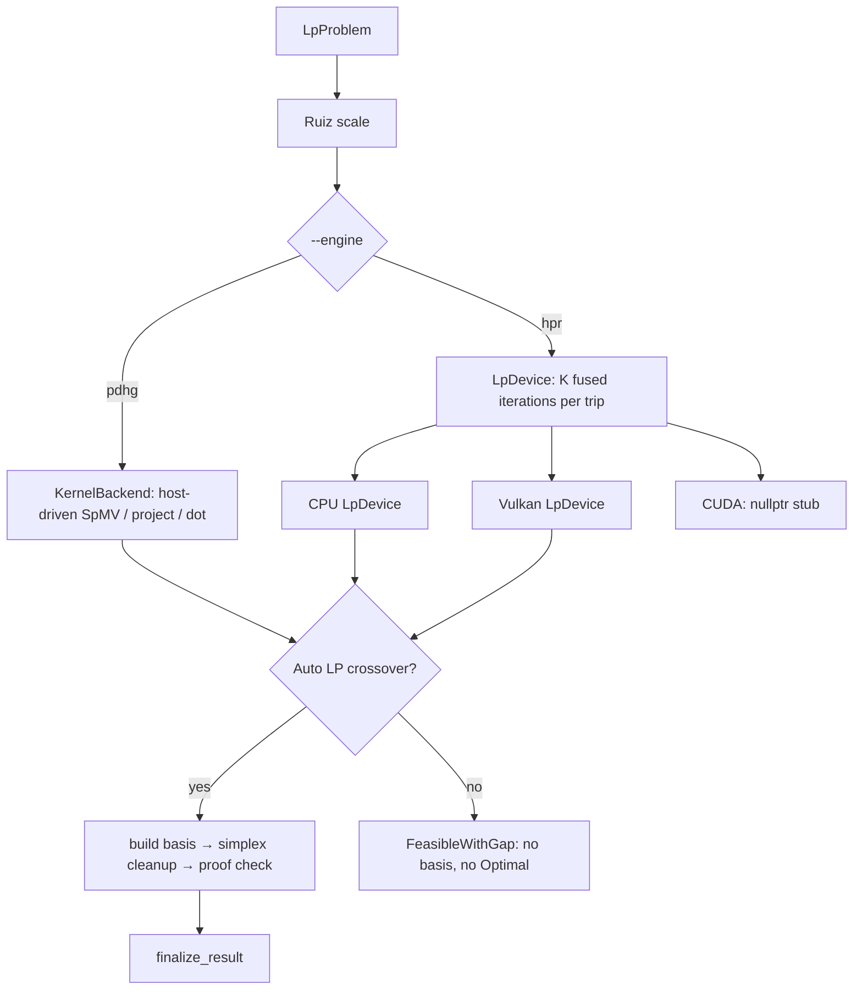
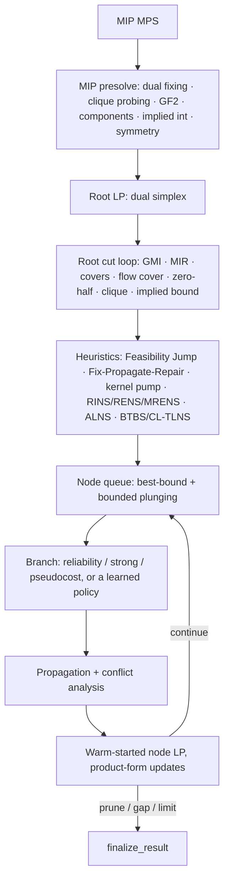
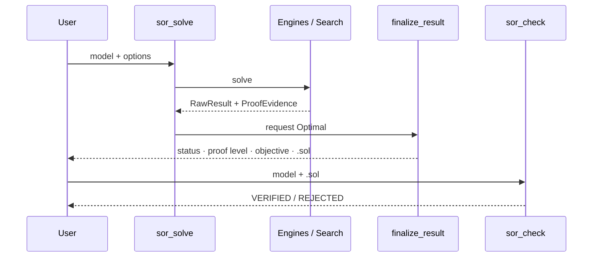

# Forge: Architecture

Forge is a from-scratch LP / MILP / QP / QCQP / MIQP solver built for SIH26119
(MRPL). This page describes how it is organized. The code under `src/`,
`apps/` and `CMakeLists.txt` is authoritative; if this page disagrees with it,
the code is right.

The companion page [`paper_bibliography.md`](paper_bibliography.md) lists the
papers each component is implemented from.

---

## 0. Capability map

| Area | State | Where |
|---|---|---|
| MPS / QPS / QPLIB / solution I/O, gzip | shipped | `src/io/` |
| Primal + dual revised simplex | shipped | `simplex.cpp`, `dual_simplex.cpp` |
| Harris ratio test, BFRT, Devex, exact DSE, EXPAND anti-degeneracy | shipped | `dual_ratio_test.cpp`, `dual_edge_weights.cpp`, `dual_simplex.cpp` |
| Markowitz LU, hypersparse FTRAN/BTRAN | shipped | `src/la/src/lu.cpp` |
| Forrest–Tomlin update (standalone LP default), product form (MILP node LPs), collective FT (opt-in) | shipped | `lu.cpp` |
| AMD ordering, supernodal LDLᵀ, level-scheduled parallel factorization | shipped | `amd.cpp`, `ldlt.cpp` |
| LP presolve + postsolve | shipped | `src/presolve/` |
| Ruiz scaling | shipped | `pdhg.cpp` (`ruiz_scale`), shared with simplex |
| PDHG, HPR first-order LP | shipped | `pdhg.cpp`, `hpr.cpp` |
| First-order → basis crossover | shipped (Auto LP) | `crossover.cpp` |
| MILP branch-and-cut | shipped | `src/search/` |
| MIP presolve: dual fixing, clique probing, GF(2), components, implied integers | shipped | `mip_presolve.cpp` |
| Convex QP / QCQP interior point | shipped | `qp_ipm.cpp`, `ipm_core.hpp` |
| First-order QP (PDHCG, HPR-QP) | shipped | `qp_pdhcg.cpp`, `hpr_qp.cpp` |
| Local nonconvex QCQP | shipped (can only claim feasible) | `qcqp_local.cpp` |
| MIQP / MIQCQP B&B | shipped | `miqp_bb.cpp` |
| Global spatial B&B | shipped | `global_qp.cpp` |
| Binary quadratic (tabu + QCR bound) | shipped | `binquad.cpp`, `bqp_bab.cpp` |
| AHL lattice reformulation | opt-in (`--lattice-reform`) | `lattice_reform.cpp` |
| Vulkan compute (LP, QP, PDHCG, binquad devices; 44 shaders) | shipped | `src/backend/src/vulkan/` |
| CUDA device | stub (returns `nullptr`) | `make_cuda_lp_device()` |
| `finalize_result` proof gate | shipped | `src/certify/` |
| `sor_check` independent checker | shipped for LP | `apps/sor_check.cpp` |
| Deterministic fork-join thread pool | shipped | `src/core/src/parallel.cpp` |
| LP barrier / IPM | not built | — |
| Exact rational / VIPR verifier (`sor_verify`) | not built | proof-level enums exist, but there is no target |
| Minimal NLP / MINLP placeholders | placeholder | `nlp.cpp`, `minlp.cpp` (MINLP is enumeration over finite integer domains) |

---

## 1. Design principles

| Principle | How it is enforced |
|---|---|
| **Clean room** | No solver library in the link graph. `tests/test_forbidden_dependencies.py` checks CMake and the binary with `ldd`, `readelf` and `nm` (§8). |
| **Strict layering** | The `add_subdirectory()` order *is* the layer order. `target_link_libraries` only reaches lower layers. |
| **One shared model** | LP, MILP and every quadratic class use `model::LpProblem`. `engines::QpProblem` wraps an `LpProblem` and adds `Q` or a diagonal Q. |
| **Only certified claims** | Engines return a `RawResult`. Only `certify::finalize_result()` can set `Status::Optimal` (§4). |
| **Determinism** | Thread chunk sizes do not depend on the thread count, and `SOR_DETERMINISTIC_FP=ON` sets `-ffp-contract=off`. Results are bit-identical at any `--threads`. |
| **Routing by outcome** | `auto` routes by problem class. If an engine does not certify its result, the remaining time budget goes to another method, not to a size threshold guessed in advance. |
| **Fail loudly** | Malformed input, an unknown option, or an output path that cannot be written is refused before solving, and no claim is made. |

---

## 2. Layer map (CMake targets)

```text
L8  FRONT ENDS     sor_solve · sor_check · sor_gen · sor_ldlt_bench · sor_gpu_bench
L7  VERIFICATION   sor_certify   (finalize_result, check_lp_point, Farkas checks)
L5  SEARCH         sor_search    (bab · cuts · propagate · heuristics · miqp_bb · global_qp · binquad)
L4  ENGINES        sor_engines   (simplex · dual_simplex · pdhg · hpr · crossover · qp_ipm · qp_pdhcg · qcqp_local)
L3  TRANSFORM      sor_presolve
L2  MODEL / I/O    sor_model · sor_io
L1  LINEAR ALGEBRA sor_sparse · sor_la_cpu · sor_backend (+ Vulkan shaders)
L0  PLATFORM       sor_core      (Status, ProofLevel, results, thread pool)
```



`sor_check` does not link `sor_search`, so it cannot call any of the search
code it is checking.

---

## 3. Solve flows

```text
        MPS / QPS / QPLIB (.gz)
                 │
                 ▼
          model::LpProblem  ◄── shared by LP / MILP / QP / MIQP
                 │
       presolve + Ruiz scaling
                 │
        engine (--engine, or auto)
      ┌──────────┼──────────┬───────────────┐
      ▼          ▼          ▼               ▼
     LP        MILP        QP        MIQP / nonconvex
  simplex /  branch-and-  IPM /     B&B / spatial B&B /
  PDHG/HPR     cut        PDHCG        binquad
      └──────────┴──────────┴───────────────┘
                 │
          finalize_result  ── the only writer of Status::Optimal
                 │
        status · proof level · objective · .sol
                 │
                 ▼
     sor_check (separate binary, re-reads the raw file)
```

### 3.1 LP: revised simplex (default proof path)



Each pivot runs: price → ratio test → factor update → FTRAN/BTRAN. The factor
is rebuilt when any of four triggers fires: update count, eta/factor nonzero
ratio, work ratio, or U-growth (`--refactor-*`). Infeasible and unbounded
results carry a Farkas ray or a primal ray.

### 3.2 LP: first-order (PDHG / HPR) and the GPU path



- **Device-resident state.** `LpDevice` and `QpDevice` keep all iterate
  vectors on the device. The host requests K fused iterations at a time, and
  the only data read back in the loop is a handful of scalars every
  `check_every` iterations.
- **Shaders.** SpMV (CSR/CSC), primal and dual steps, Halpern mixing,
  averaging, PDHCG and QP steps, and binquad tabu/bound kernels: 44 compute
  shaders compiled to SPIR-V at build time.
- **Honest timing.** GPU wall times include host–device transfer
  (`transfer_stats()`).
- **Proof boundary.** A first-order method alone cannot claim
  `ProvedOptimalFP`. Auto LP can cross over to a simplex basis, and that
  basis must then pass the same proof check as simplex.
- **Batched seam.** Batched PDHCG and batched LP devices can bound several
  problems in one dispatch. MILP uses this for batched strong-branching and
  OBBT LPs (`--batch-lp-sb`, `--batch-lp-obbt`).

GPU-capable engines: `hpr`, `hprqp`, `qp`, `binquad`. Simplex, MILP, `qpipm`,
`miqp` and `global` always run on the CPU.

### 3.3 MILP: branch-and-cut



- **Policy.** `--milp-policy latest` (the default) enables the adaptive and
  learned components: DynSep, L2Sep, HGTSM, GCS cut selection, and
  sparse-SB / SC-MILP / Lifted / PlanB&B branching. `classical` is the
  textbook ablation.
- **Parallel tree.** `--bab-threads` (0 = auto).
- **Limitation.** Cuts are separated at the root only. The tree adds conflict
  and nogood cuts, but no new GMI/MIR rounds.
- **Lattice (opt-in).** `--lattice-reform` applies an AHL/LLL reduction to
  pure-integer equality systems before B&B. μ bounds are the exact LP
  projection of the original box. Pure-integer systems are shipped as exact
  equivalents. Restricted systems are certified against the original LP bound
  or re-solved in full.

### 3.4 Quadratic engines

```text
QPS / QPLIB / --q-diag
   │
   ├─ convex, certified PSD ──► qpipm (supernodal LDLᵀ of a regularised KKT
   │                              + FGMRES on the true system) ──► ProvedKKT
   ├─ first-order ────────────► qp / hprqp (CPU or Vulkan) ──► residual test
   ├─ diagonal Q, one row ────► exact one-row fast path
   ├─ nonconvex QCQP, local ──► qcqplocal ──► Feasible only
   ├─ integers, convex nodes ─► miqp (IPM node relaxations)
   ├─ nonconvex, global ──────► global (McCormick/RLT, αBB, PSD cuts,
   │                              FBBT/OBBT, integer branching in one tree)
   └─ binary quadratic ───────► binquad (tabu + QCR bound)
```

Every quadratic claim is re-checked in the model's original units. The check
allows for rounding with a Higham γₖ bound, and dual bounds are computed from
the returned multipliers with rounding charged. See [`../QP.md`](../QP.md).

### 3.5 Verification



`sor_check` checks:

| Class | Checks | Status |
|---|---|---|
| LP | row and column bounds, recomputed objective, dual/reduced-cost residual, primal–dual gap, Farkas ray (infeasible), primal ray (unbounded) | complete |
| MILP | bounds and objective pass, but the LP dual/gap test also runs and rejects correct answers; integrality is not checked | known gap |
| QP | the QUADOBJ section is ignored | not supported |

QPLIB solutions are checked independently by `scripts/qplib_eval.py`, which
shares no code with the solver and also checks integrality.

---

## 4. Core types (`src/core/include/sor/core/result.hpp`)

**Status:** `NotSolved` · `Optimal` · `Infeasible` · `Unbounded` ·
`InfeasibleOrUnbounded` · `Feasible` · `NoSolutionFound` · `Interrupted` ·
`NumericalFailure` · `Unsupported`

**ProofLevel** (in increasing strength): `None` · `BoundOnly` · `FeasibleOnly`
· `FeasibleWithGap` · `ProvedKKT` · `ProvedGlobalEpsilon` · `ProvedOptimalFP`
· `ProvedOptimalExact` · `ProvedOptimalCertified`

Only `finalize_result()` may set `Optimal`, and only when the proof is
sufficient and the internal checker has passed. `tests/test_no_unproved_optimal`
enforces this. `ProvedOptimalExact` and `ProvedOptimalCertified` are reserved:
no engine produces them yet.

| Level | Typical source |
|---|---|
| `ProvedOptimalFP` | simplex basis, or a basis from crossover, with residuals in tolerance |
| `ProvedGlobalEpsilon` | MILP / MIQP / global tree closed within the gap tolerance |
| `ProvedKKT` | convex QP from the IPM or a first-order method passing the KKT check |
| `FeasibleWithGap` | incumbent plus a valid bound, gap still open |
| `FeasibleOnly` | verified feasible point, no bound |

---

## 5. Module contracts

| Concern | Header |
|---|---|
| Results / proof | `src/core/include/sor/core/result.hpp` |
| Thread pool | `src/core/include/sor/core/parallel.hpp` |
| CSR / CSC | `src/sparse/include/sor/sparse/{csr,csc}.hpp` |
| Sparse LU | `src/la/include/sor/la/lu.hpp` |
| LDLᵀ (with AMD ordering) | `src/la/include/sor/la/ldlt.hpp` |
| `KernelBackend` | `src/backend/include/sor/backend/kernel_backend.hpp` |
| `LpDevice` / `QpDevice` | `src/backend/include/sor/backend/{lp_device,qp_device}.hpp` |
| Model | `src/model/include/sor/model/lp.hpp` |
| I/O | `src/io/include/sor/io/{mps,qps,qplib,solution}.hpp` |
| Presolve | `src/presolve/include/sor/presolve/presolve.hpp` |
| Engines | `src/engines/include/sor/engines/*.hpp` |
| Search | `src/search/include/sor/search/*.hpp` |
| Proof gate | `src/certify/include/sor/certify/finalize.hpp` |

### Basis update methods (`lu.hpp`)

| Method | Default for | Notes |
|---|---|---|
| `ForrestTomlin` | standalone LP | re-triangularises the bump; hypersparse base solves |
| `ProductForm` | MILP node LPs | eta file; cheap to warm-start |
| Collective FT | opt-in (`--collective-ft`) | folds pending etas into the FT factor during cleanup |

---

## 6. Command line

```text
sor_solve MODEL [--engine E] [--backend cpu|vulkan|cuda] [--time-limit S]
                [--threads N] [--solution-out PATH] [--list-opts [ENGINE]] ...
sor_check MODEL SOLUTION.sol [--tol T]
sor_gen   blend|schedule|dispatch|all [--seed N] [-o PATH | --outdir DIR]
```

The full reference is in [`../CLI_FLAGS.md`](../CLI_FLAGS.md): 142 flags and
68 `KEY=VALUE` engine options.

---

## 7. Build options

| CMake option | Default | Effect |
|---|---|---|
| `SOR_ENABLE_VULKAN` | `ON` | Build the Vulkan backend. Needs `libvulkan-dev` and `glslang-tools` |
| `SOR_DETERMINISTIC_FP` | `ON` | `-ffp-contract=off` for bit-reproducible floating point |
| `SOR_NATIVE_ARCH` | `OFF` | `-march=native` (not portable) |
| `SOR_WARNINGS_AS_ERRORS` | `ON` | Treat warnings as errors |

The only `find_package` dependencies are `Threads`, `ZLIB`, `Vulkan`
(optional) and `Python3` (tests only).

---

## 8. Clean-room boundary

- The solve path does not link, call, vendor or translate any third-party
  solver code. Papers are allowed. Solver source code (HiGHS, CBC, SCIP,
  OR-Tools, cuOpt, cuPDLPx, HPR-LP, PaPILO, …) is not.
- External solvers are used only as benchmark or correctness references, run
  as separate processes from `benchmarks/.venv-baseline`. That environment is
  in `.gitignore` because it contains `libhighs.so`.
- `tests/test_forbidden_dependencies.py` scans the CMake files and the
  `sor_solve` binary (with `ldd`, `readelf -d` and `nm -C`) for the names
  `highs`, `gurobi`, `cplex`, `scip`, `coin-or`, `clp`, `cbc`, `glpk`,
  `mosek`, `xpress` and `ortools`.
- The binary's runtime dependencies are `libz`, `libstdc++`, `libm`,
  `libgcc_s`, `libc` and, with Vulkan enabled, `libvulkan`.

---

## 9. Known gaps

1. Per-node cut separation in MILP.
2. `sor_check` support for MILP (integrality and bounds only) and for QPS.
3. LP barrier / IPM.
4. CUDA `LpDevice`.
5. Exact rational verification and VIPR (`sor_verify`).
6. Presolve: duplicate row/column detection and coefficient strengthening.
7. A parallel dual simplex.

---

## 10. Glossary

| Term | Meaning |
|---|---|
| SGM | Shifted geometric mean of runtimes |
| FTRAN / BTRAN | Forward / backward solves with the basis factors |
| BFRT | Bound-flipping (long-step) dual ratio test |
| DSE | Dual steepest-edge pricing |
| HPR | Halpern-accelerated, restarted, reflected PDHG |
| PDHCG | Primal-dual hybrid conjugate gradient, for QP |
| `LpDevice` | A compute device that owns the first-order state; the host requests fused iterations |
| `ProvedOptimalFP` | Optimal basis at f64 tolerances; the usual commercial meaning of "Optimal" |
| Crossover | Converting a first-order point into a simplex basis |
