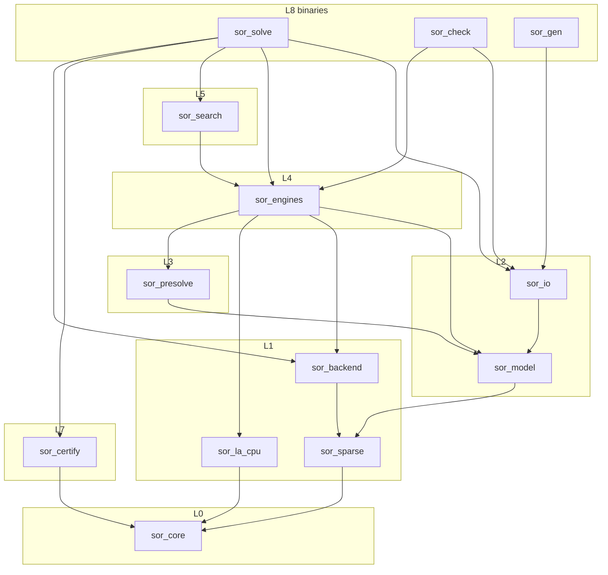
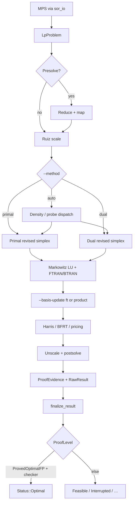
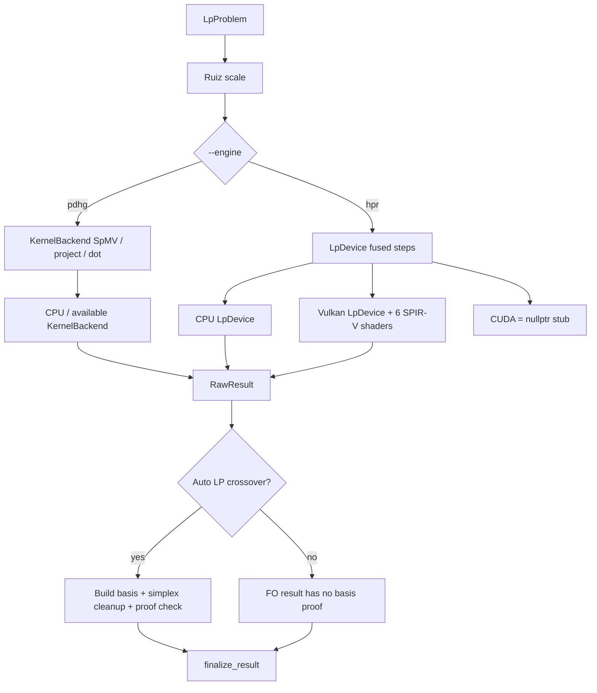
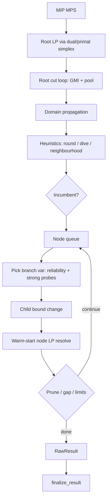
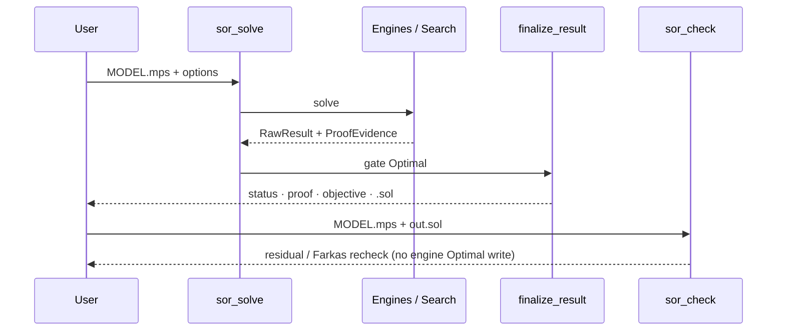

# SOR — Architecture

**Product:** SOR (Sovereign Optimization Runtime)  
**PS:** SIH26119 (MRPL — Indigenous GPU-Accelerated Optimization Solver)  
**Rule:** code under `src/`, `apps/`, and `CMakeLists.txt` wins over any paragraph here.
**Measured numbers:** committed `benchmarks/results/compare-netlib-20260904-152608.md` (historical configuration).
**Companion:** `paper_bibliography.md`

---

## 0. What exists

Capabilities are checked against CMake targets and headers. Benchmark results
in §7 describe the configuration used for each committed run.

| Area | State | Evidence |
|---|---|---|
| MPS / QPS / solution I/O | **shipped** | `src/io/`; Netlib 93/93 parse |
| Primal + dual revised simplex | **shipped** | `simplex.cpp`, `dual_simplex.cpp`; Auto dispatch |
| Markowitz LU, hypersparse FTRAN/BTRAN | **shipped** | `src/la/src/lu.cpp`; `test_lu` |
| Forrest–Tomlin update | **shipped (standalone LP default)** | `--basis-update product` selects product form; MILP node LPs default to product form; `collective_ft` remains opt-in and applies to product form |
| Harris / BFRT / Devex / DSE | **shipped** | `dual_bfrt.cpp`, `dual_edge_weights.cpp` |
| Presolve + postsolve (v1) | **shipped** | `src/presolve/` — Andersen-class subset |
| Ruiz scaling | **shipped** | shared via engines / `simplex_prepared` |
| PDHG (vanilla) | **shipped** | `pdhg.cpp` + `KernelBackend` |
| HPR on `LpDevice` | **shipped** | `hpr.cpp`; CPU + Vulkan |
| Vulkan SPIR-V (6 shaders) | **shipped** | `SOR_ENABLE_VULKAN=ON` default |
| CUDA `LpDevice` | **stub** | `make_cuda_lp_device()` → `nullptr` |
| MILP B&B + root GMI cuts | **shipped** | `src/search/` — root cuts only |
| AHL lattice reform | **opt-in** | `--lattice-reform`; exact LP-projection μ bounds + exact-equivalence direct-ship / LP-bound certification protocol; markshare1/2 apply, verified correct, 0 incumbent even at 1800s (genuinely hard search, not an implementation gap) |
| Convex QP (+ diagonal fast path) | **shipped** | `qp.cpp`, `qp_pdhcg.cpp` |
| `finalize_result` gate | **shipped** | sole writer of `Status::Optimal` |
| `sor_check` independent checker | **shipped** | CLI; not a VIPR verifier |
| `sor_verify` / rational / VIPR | **not built** | enums exist; no target |
| FO→basis crossover | **shipped in Auto LP** | `crossover.cpp`; `--[no-]fo-crossover`; simplex cleanup and proof check still required |
| Barrier / IPM | **not built** | — |
| Netlib simplex (committed run) | **93/93** Optimal | SGM 0.2189 s vs HiGHS 0.0866 s |

`solver_accl/` is a first-party Julia solver with its own whole-model and batch
API. It is not a CMake target or a C++ engine dependency. See
`solver_accl/VENDORED.md` for its dependencies and runtime requirements.

---

## 1. Design commitments (as enforced today)

| # | Commitment | Reality in tree |
|---|---|---|
| C1 | Device-resident FO path | **HPR** uses `LpDevice` (CPU / Vulkan). PDHG still uses host-driven `KernelBackend`. CUDA stub only. |
| C2 | Structure-preserving IR | **Partial** — `LpProblem` + integer flags; full `StructureMap` / ExprDag not present |
| C3 | Deterministic by construction | **Partial** — no wall-clock in status claims; no `DetTick` module / bit-identical CI yet |
| C4 | Numeric tower f32/f64/rational | **f64 working**; f32 device path partial; rational types / `sor_num` **absent** |
| C5 | Policy seam | **Classical only** inside `bab.cpp` (reliability / strong-branch probes) |
| C6 | Reversible transforms | **Presolve postsolve** exists; certifying proof steps per reduction **not** emitted |

**Invariant that *is* enforced:** engines emit `RawResult`; only `sor::certify::finalize_result()` may write `Status::Optimal` (`tests/test_no_unproved_optimal`).

---

## 2. Layer map (actual CMake targets)

```text
L8  FRONT ENDS     sor_solve · sor_check · sor_gen
L7  VERIFICATION   sor_certify  (finalize_result)
                   sor_check CLI  (independent residual / Farkas recheck)
                   ✗ sor_verify executable — not in CMake
L5  SEARCH         sor_search   (bab · cuts · propagate · miqp · minlp)
L4  ENGINES        sor_engines  (simplex · dual_simplex · pdhg · hpr · crossover · qp · nlp · farkas)
L3  TRANSFORM      sor_presolve
L2  MODEL / I/O    sor_model · sor_io
L1  LINEAR ALGEBRA sor_sparse · sor_la_cpu · sor_backend (+ Vulkan shaders)
L0  PLATFORM       sor_core     (Status, ProofLevel, result records)
```

Layering is enforced by `target_link_libraries` in `CMakeLists.txt`.  
There is no separate layering checker script; inspect CMake link edges when changing module dependencies.

### 2.1 Link graph



---

## 3. End-to-end solve flows

### 3.1 LP — revised simplex (default proof path)



**Hot loop (per pivot):** price → ratio test → LU update → FTRAN/BTRAN  
**Proof:** basis + dual/primal residuals inside tolerances → `ProvedOptimalFP`.

### 3.2 LP — first-order (PDHG / HPR)



**Shaders (Vulkan):** `spmv_csr` · `spmv_csc` · `primal_step` · `dual_step` · `halpern_mix` · `avg_update`  
**Honesty rule:** GPU wall times must include H2D/D2H (`transfer_stats` on the device path).  
**Proof boundary:** FO alone cannot claim `ProvedOptimalFP`. Auto LP may
crossover to simplex; the resulting basis must pass the proof check.

### 3.3 MILP — branch-and-cut (root cuts)



**Today:** cuts are **root-only** (`cuts.hpp`). Per-node cut extension needs basis-extension machinery not present.  
**CLI:** `sor_solve --engine milp`.  
**Lattice (opt-in):** `--lattice-reform` runs AHL/LLL equality reduction before B&B (`lattice_reform.hpp`); μ bounds are the exact LP projection of the original box through `Q`; pure-integer systems ship directly (exact equivalence), forced-zero restrictions (e.g. markshare deviations) certify against the original LP bound or fall back to a full re-solve; postsolve maps μ→x. Needed for market-split; not yet enough alone for MIPLIB markshare Optimal within practical time budgets.

### 3.4 Convex QP

```text
QPS / --q-diag  →  PSD gate  →  diagonal active-set (exact one-row path)
                              →  or sparse PDHCG-II-class iterate
                              →  KKT / Wolfe-gap evidence
                              →  finalize_result → ProvedKKT / Optimal
```

### 3.5 Verification path (what ships)



`sor_verify` (VIPR / rational replay, no engine link) remains a **design target**, not a binary.

---

## 4. Core types (`src/core/include/sor/core/result.hpp`)

### Status

`NotSolved` · `Optimal` · `Infeasible` · `Unbounded` · `InfeasibleOrUnbounded` · `Feasible` · `NoSolutionFound` · `Interrupted` · `NumericalFailure` · `Unsupported`

### ProofLevel (strictly increasing)

`None` · `BoundOnly` · `FeasibleOnly` · `FeasibleWithGap` · `ProvedKKT` · `ProvedGlobalEpsilon` · `ProvedOptimalFP` · `ProvedOptimalExact` · `ProvedOptimalCertified`

Only `finalize_result()` may set `Optimal`, and only with sufficient proof + `checker_passed`.

---

## 5. Module contracts (pointers into code)

| Concern | Header / source |
|---|---|
| Results / proof | `src/core/include/sor/core/result.hpp` |
| CSR / CSC | `src/sparse/include/sor/sparse/{csr,csc}.hpp` |
| Sparse LU | `src/la/include/sor/la/lu.hpp` |
| `KernelBackend` | `src/backend/include/sor/backend/kernel_backend.hpp` |
| `LpDevice` | `src/backend/include/sor/backend/lp_device.hpp` |
| Model | `src/model/include/sor/model/lp.hpp` |
| MPS/QPS | `src/io/include/sor/io/{mps,qps,solution}.hpp` |
| Presolve | `src/presolve/include/sor/presolve/presolve.hpp` |
| Engines | `src/engines/include/sor/engines/*.hpp` |
| Search | `src/search/include/sor/search/{bab,cuts,propagate,lattice_reform}.hpp` |
| Gate | `src/certify/include/sor/certify/finalize.hpp` |

### Update methods (`lu.hpp`)

| Method | Default? | Role |
|---|---|---|
| `ProductForm` | **MILP node LP default** | eta file; cost grows with eta nnz |
| `ForrestTomlin` | **standalone LP default** | re-triangularize bump; hypersparse base solves shared |
| Collective collapse | `collective_ft` (simplex option) | `collapse_pending_into_ft()` folds pending etas via FT; not full Huangfu APF |

---

## 6. CLI surface

```text
sor_solve MODEL.mps
  --engine  simplex | pdhg | hpr | milp | qp
  --backend cpu | vulkan | cuda
  --method  auto | primal | dual
  --basis-update ft | product
  --solution-out PATH

sor_check MODEL.mps SOLUTION.sol
sor_gen   blend | schedule | dispatch | all
```

---

## 7. Measured snapshot (do not invent)

**Host:** `yash-Bravo-15-B5DD` · Linux 6.17 · 12 CPUs · AMD Radeon RX 5500M available for Vulkan.

### Netlib LP — `compare-netlib-20260904-152608` (93 inst, 30 s)

| Solver | Solved | Obj match | SGM (s) |
|---|---:|---:|---:|
| SOR-simplex | **93/93** | 93/93 | **0.2189** |
| HiGHS (external) | 93/93 | 93/93 | **0.0866** |

- This committed comparison reports 93/93 solved and objective matched. It
  does not measure the FT-default or crossover configuration.
- Ratio vs HiGHS SGM: **2.53×** for this dated run.
- FO alone has no basis proof; Auto LP can attempt simplex crossover.

### Industrial ladder — `industrial-perf-20260904-101927` (seed 42, 120 s)

| Kind | Pattern |
|---|---|
| blend_lp S→HUGE | All **Optimal**, obj agrees with HiGHS; SOR wall **faster** from M upward (HUGE **4.34×**) |
| schedule_milp S→HUGE | All **Optimal**, obj agrees; SOR slower as size grows (HUGE **0.03×** vs HiGHS) |
| dispatch_qp S→XL | Optimal + agree; large diagonal path very fast vs HiGHS-QP |
| dispatch_qp XXL/HUGE | SOR Optimal; HiGHS timed out → **obj disagree flagged** (honest) |

### MIPLIB-easy + demos — `compare-new-all-20260904-102744`

- Coverage: **23/23** incumbents (12 Optimal · 11 Feasible).
- Proved Optimal examples: `blend2`, `enigma`, `flugpl`, `mod010`, `p0033`, `p0201`, `rgn`, plus demos.

### Clean-room link check

`ldd build/sor_solve` (Vulkan ON): `libvulkan` + libstdc++ / libm / libgcc / libc — **no** HiGHS / SCIP / CBC / cuOpt.

---

## 8. Clean-room boundary

The C++ solve path does not link to or translate third-party solver code.
External solvers are benchmark and correctness oracles only. `solver_accl/`
follows the same rule and runs independently, using a coarse-grained,
out-of-process API rather than per-iteration calls. Linking it into CMake
would add Julia and optional GPU package requirements and requires a separate
build decision.

## 9. Capability ladder (claimable vs not)

| Capability | Claim? |
|---|---|
| From-scratch solve path | **Yes** — CMake + `ldd` |
| Netlib LP solved at scale | **Yes** — 93/93 in the committed comparison |
| Dual simplex + BFRT + DSE/Devex | **Yes** |
| FT update available | **Yes** — standalone LP default; product-form for MILP node LPs |
| Hypersparse triangular solves | **Yes** — base L/U; eta path still product-form cost |
| MILP vertical slice | **Yes** — with honest Feasible majority on hard MIPLIB-easy |
| Convex QP vertical slice | **Yes** |
| Vulkan HPR path | **Yes** — measure transfer-inclusive |
| Faster than HiGHS on Netlib SGM | **No** — 2.53× slower in the committed comparison |
| Million-var proved MIP | **No** |
| VIPR / rational certified | **No** — not built |
| Crossover FO→basis | **Yes** — Auto LP path, followed by simplex proof check |
| Linked foreign solver | **Never** |

---

## 10. Roadmap seams (architecture present, code partial/absent)

Keep these seams; do not claim them as shipped:

1. **Crossover maturity** — broaden coverage and measure FO-to-basis on larger LPs
2. **`sor_verify`** — separate target; L0–L2 only  
3. **Certifying / broader presolve** — probing, dual fixing, aggregation  
4. **Per-node cuts + more cut families**  
5. **CUDA `LpDevice`** and batched SpMV for strong branching  
6. **Barrier IPM** (late)  

Papers / implement order: `paper_bibliography.md`.  

---

## 11. Glossary (short)

| Term | Meaning here |
|---|---|
| SGM | Shifted geometric mean of runtimes |
| FTRAN/BTRAN | Forward/backward triangular solves vs basis factors |
| BFRT | Bound-flipping (long-step) dual ratio test |
| HPR | Halpern-accelerated restarted first-order LP |
| `LpDevice` | Device owns FO state; host requests fused iterations |
| `ProvedOptimalFP` | Basis optimal at f64 tolerances — commercial “Optimal” |
| Clean-room | Papers allowed; linking/translating solver source forbidden |

---

*Last verified against tree + benches: 4 Sep 2026.*
