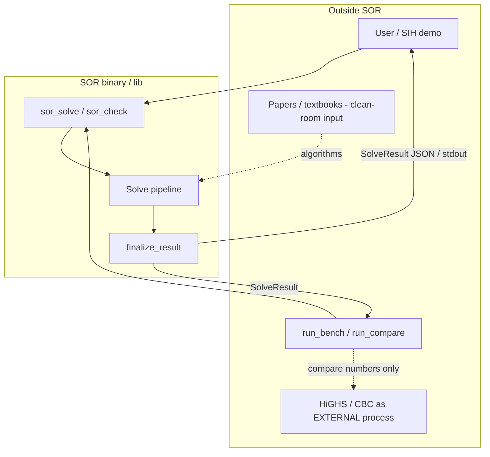
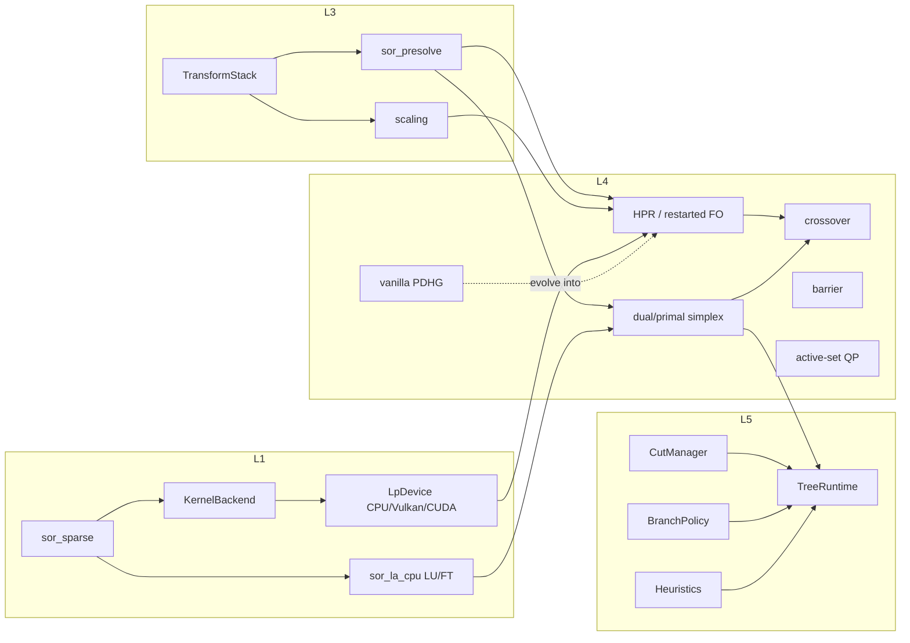
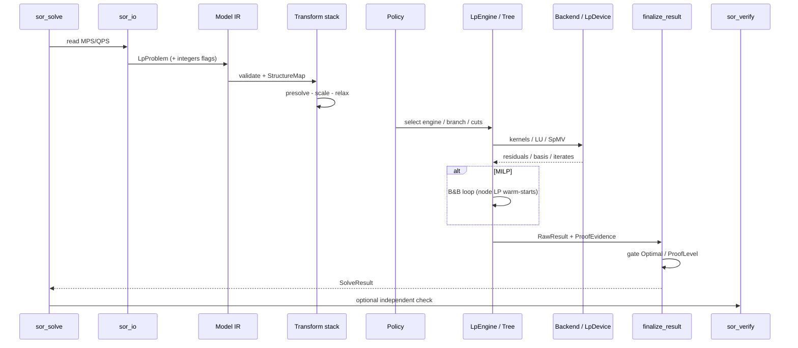
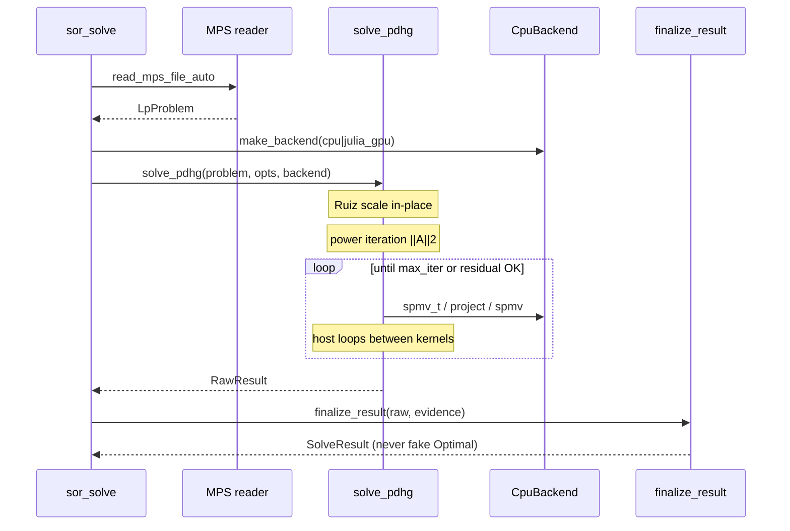
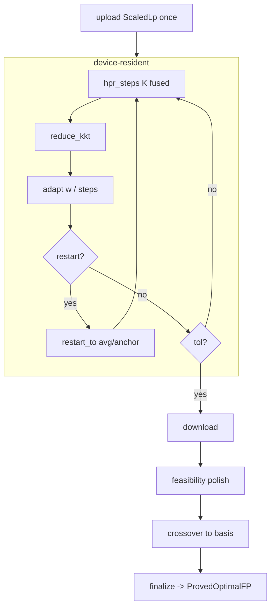
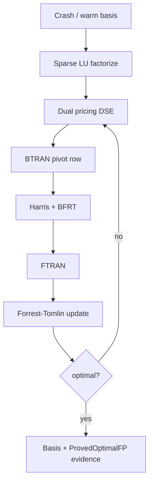
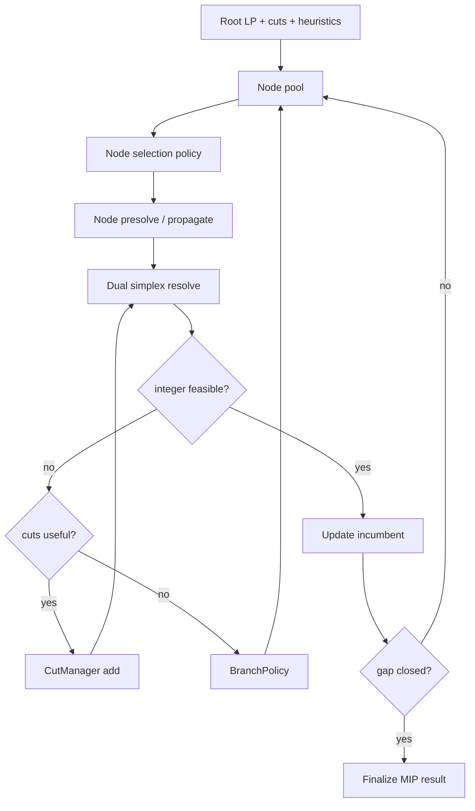
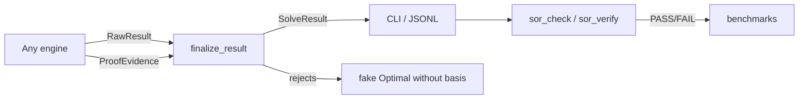
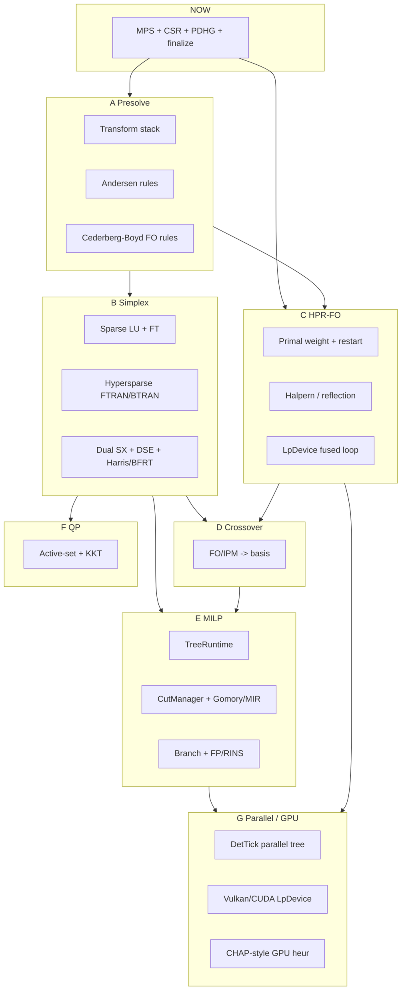

# SOR — Architecture

**Product:** SOR (Sovereign Optimization Runtime)
**Target problem statement:** SIH26119 (MRPL — Indigenous GPU-Accelerated Optimization Solver)
**Status:** single architecture doc — contracts (C1–C6), APIs, **and** top-down diagrams / solver loops / stitching (Appendix A). GPU seam: `gpu_first_order_plan.md`. Papers: `paper_bibliography.md`.
**Scope:** this is the only architecture document. There is no older revision to consult and no separate diagram file — top-down views live in Appendix A.

---

## 0. Load-bearing design decisions

The deadline constrains only *what ships first*, never *what the architecture permits*. Every seam below exists so the frontier algorithm can land later without a rewrite.

Each row is a decision that is expensive-to-impossible to reverse once code exists, with the reason it went that way. Process differentiation — checker, certificates, honest labels, clean-room CI — is necessary hygiene but is not competitiveness: a solver with a world-class checker and a mediocre simplex is a mediocre solver.

| Decision | Reason |
|---|---|
| **Crossover to a basis is in the architecture.** A first-order result can reach `ProvedOptimal` rather than terminating at `FeasibleOnly` | Without it the GPU path is permanently capped at "approximate". Megiddo / Bixby–Saltzman crossover is a known algorithm, not research |
| **Determinism is a hard requirement**, not best-effort. `DetTick` accounting in every parallel construct from day one | Industry treats run-to-run reproducibility as non-negotiable, and determinism cannot be retrofitted onto a work-stealing tree |
| **The pooling problem is the product.** The global nonconvex path is a first-class layer, not a documented surrogate | Refinery blending *is* bilinear. Aspen PIMS uses successive-LP and lands in local optima. This is the winnable fight |
| **GPU serves more than first-order LP** — also batched strong branching, batched LNS, batched decomposition subproblems, scenario sweeps | Batched small-LP throughput is the one capability legacy codebases structurally cannot retrofit, because it is a data-layout property |
| **Structure annotations survive every transform**; the IR does not flatten to a matrix at the presolve boundary | Decomposition, symmetry detection, and family memory all need structure that flattening destroys |
| **Barrier is sequenced late but architecturally present.** Convex QP goes first-order → active-set → barrier | Deferring is fine; excluding forecloses conic and large-QP work permanently |
| **A `ProofLevel` ladder** up to VIPR-verified and rational-exact, not certificates as a mere audit artifact | This is the one axis where SOR can be world-best, because the field is nearly empty |
| **An adoption path exists:** MPS/CLI/native API, plus optional CPLEX/Gurobi shims for direct-API callers — not PIMS, whose AO solver is proprietary | A sovereign solver nobody can call standalone is a research project |

---

## 1. Design commitments

Six commitments. Each is expensive-to-impossible to retrofit, so each is load-bearing in the module layout below.

| # | Commitment | Enforced by |
|---|---|---|
| C1 | **Device-resident data model.** CPU is a backend, not the default | ⚠ **Not currently enforced.** `DeviceBuffer` is a `std::vector` with `operator[]` and `host()`, so host addressability is part of the contract and the PDHG loop depends on it. The commitment stands; the mechanism must become the `LpDevice` seam in §3.3.1 |
| C2 | **Structure-preserving IR.** Block / period / network / bilinear annotations survive transforms | `StructureMap` threaded through `Transform`; layering test forbids engines constructing matrices directly |
| C3 | **Deterministic by construction.** Identical input + options + thread count → identical output, bit for bit | `DetTick` budget accounting; no wall-clock in any control-flow decision |
| C4 | **Three-tier numeric tower.** f32 (device) / f64 (working) / rational (verification) | `Scalar` concept; algorithms generic over scalar type |
| C5 | **Policy seam at every discrete decision** | `Policy<D>` interface with a classical default; learned implementations are optional and hot-swappable |
| C6 | **Reversible transform stack.** Presolve, scaling, decomposition, relaxation are all invertible and each emits proof steps | `Transform` interface; postsolve is generated, not hand-written per reduction |

A seventh, non-negotiable rule that is not a commitment but a constraint: **verification never links the engines** (§11).

---

## 2. Layer map

```text
L8  FRONT ENDS        sor_solve · sor_check · sor_bench · sor_gen · sor_tune
                      ────────────────────────────────────────────────────
L7  VERIFICATION      sor_certify (emit)  │  sor_verify (SEPARATE TARGET)
                      no engine linkage ──┘  rational · Farkas · KKT · VIPR
                      ────────────────────────────────────────────────────
L6  INTELLIGENCE      sor_policy (classical + learned, distilled)
                      sor_memory (family fingerprint → basis/cuts/config)
                      ────────────────────────────────────────────────────
L5  SEARCH            sor_search (tree runtime, deterministic parallel)
                      sor_cuts · sor_branch · sor_heur · sor_propagate
                      sor_global (spatial B&B) · sor_decomp (DW/Benders)
                      ────────────────────────────────────────────────────
L4  ENGINES           sor_simplex · sor_firstorder · sor_barrier
                      sor_crossover · sor_qp · sor_nlp
                      ────────────────────────────────────────────────────
L3  TRANSFORM         sor_transform (stack) · sor_presolve (reductions)
                      ────────────────────────────────────────────────────
L2  MODEL             sor_model (IR + StructureMap) · sor_io · sor_api
                      ────────────────────────────────────────────────────
L1  LINEAR ALGEBRA    sor_sparse · sor_la_cpu · sor_la_gpu
                      sor_backend (KernelBackend contract)
                      ────────────────────────────────────────────────────
L0  PLATFORM          sor_core (types, arenas, log, hash)
                      sor_det (DetTick) · sor_num (Scalar tower)
```

**Layering rule (CI-enforced by `scripts/check_layering.py`):** a module may include only from strictly lower layers, plus siblings explicitly declared in `docs/layering.toml`. `sor_verify` may include only L0–L2.

---

## 3. Core contracts

These six headers are the architecture. Everything else is an implementation of one of them.

### 3.1 Number tower — `sor_num/scalar.hpp`

```cpp
namespace sor::num {

// Concept satisfied by f32, f64, Interval, Rational.
template <class T>
concept Scalar = requires(T a, T b) {
    { a + b } -> std::convertible_to<T>;
    { a * b } -> std::convertible_to<T>;
    { T::zero() } -> std::same_as<T>;
    { T::is_exact() } -> std::same_as<bool>;   // constexpr
};

class Rational;            // GMP-free arbitrary precision (own limbs; see §13)
class Interval;            // directed-rounding f64 pair, for bound-safe presolve

}  // namespace sor::num
```

Algorithms that must be exactness-generic (residual evaluation, Farkas check, bound tightening, LP verification) are templated on `Scalar`. Hot inner loops (simplex pivoting, SpMV) are `f64`/`f32` monomorphic by design — genericity there costs more than it buys.

### 3.2 Determinism — `sor_det/tick.hpp`

```cpp
namespace sor::det {

// Deterministic surrogate for time. Every unit of work bumps the counter by a
// fixed, hardware-independent amount. All limits and all algorithmic decisions
// are expressed in ticks, never in seconds.
class TickCounter {
public:
    void charge(WorkKind kind, std::uint64_t units) noexcept;
    std::uint64_t ticks() const noexcept;
};

// A deterministic parallel-for. Work is partitioned by index, results are
// merged in index order, and the tick charge is independent of thread count.
template <class F>
void parallel_for_det(TickCounter&, std::size_t n, F&& body);

}  // namespace sor::det
```

**Rule C3, concretely:** `std::chrono` may appear in logging and in the benchmark harness. It may not appear in any `if` that changes the search path. `grep` for this is a CI gate.

### 3.3 Device abstraction — `sor_backend/kernel_backend.hpp`

```cpp
namespace sor::backend {

template <class T> class DeviceBuffer;   // opaque; may live on host or device

class KernelBackend {
public:
    virtual ~KernelBackend() = default;
    virtual std::string_view name() const = 0;          // "cpu" | "cuda"

    // --- single-instance kernels ---
    virtual void spmv (const SparsePattern&, const DeviceBuffer<f64>& vals,
                       const DeviceBuffer<f64>& x, DeviceBuffer<f64>& y) = 0;
    virtual void spmv_t(const SparsePattern&, const DeviceBuffer<f64>& vals,
                       const DeviceBuffer<f64>& x, DeviceBuffer<f64>& y) = 0;
    virtual void project_box(DeviceBuffer<f64>& x,
                       const DeviceBuffer<f64>& lo,
                       const DeviceBuffer<f64>& hi) = 0;
    virtual f64  dot(const DeviceBuffer<f64>&, const DeviceBuffer<f64>&) = 0;

    // --- BATCHED kernels: the differentiating capability (C1) ---
    // One shared sparsity pattern, N right-hand sides / N bound vectors.
    virtual void spmv_batched(const SparsePattern& shared,
                       const DeviceBuffer<f64>& vals,
                       const BatchView<f64>& X, BatchView<f64>& Y) = 0;
    virtual void project_box_batched(BatchView<f64>& X,
                       const BatchView<f64>& LO, const BatchView<f64>& HI) = 0;

    // Transfer cost is charged here, so it can never be omitted from a timing.
    virtual TransferStats transfer_stats() const = 0;
};

std::unique_ptr<KernelBackend> make_cpu_backend();
std::unique_ptr<KernelBackend> make_vulkan_backend(int device);  // nullptr if absent
std::unique_ptr<KernelBackend> make_cuda_backend(int device);    // nullptr if absent
}  // namespace sor::backend
```

Two properties this buys:

- **Honest GPU numbers are structural.** Transfer time accrues inside the backend, so a reported GPU time that excludes it is unreachable through the API.
- **CPU parity is testable.** `test_backend_parity.cpp` runs every kernel on both backends over the same inputs and asserts agreement to a declared tolerance. A CUDA kernel that disagrees with the CPU reference fails the build.

### 3.3.1 Why this is the wrong seam for the first-order engine

Both properties above are real and worth keeping. The **granularity** is wrong, and §5.2 item 7 says why: *"iterates never leave the GPU; a host sync per iteration destroys the entire advantage."* The implemented seam guarantees the opposite.

Three levels of the problem, all verified in code:

1. **`DeviceBuffer` is host memory by contract.** `device_buffer.hpp:66-76` exposes `operator[]` returning `T&` and a `host()` accessor over a `std::vector`. The header comment claims it "may live on host or device." It cannot — host addressability is part of the type, so every caller may depend on it, and `pdhg.cpp` does.
2. **The engine interleaves host loops with kernel calls.** `pdhg.cpp:222-237` runs four host loops around three backend calls per iteration; `evaluate()` adds five host reduction loops. On a real device that is **~7 host↔device round trips per iteration**. Measured today: 602,092 kernel calls for one `25fv47` solve.
3. **`std::swap(x.host(), x_new.host())`** at `pdhg.cpp:237` swaps the underlying vectors. Any backend that caches a device pointer per buffer is silently broken by that line. It is correct today only because everything is host memory.

**The fix is to invert the seam:** the device owns the solver state, and the host asks for `k` fused iterations and receives ~8 doubles. `KernelBackend` stays for unit tests and parity checking; the first-order engine moves to an `LpDevice` interface with `upload()`, `hpr_steps(k)`, `reduce_kkt()`, `restart_to()`, and `download()`. Six fused kernels cover the whole loop, and the CPU implements the same interface — so the CPU path gains the fusion benefit too, rather than being a fallback bolted beside a GPU path.

Full interface, kernel list, and rationale: **`gpu_first_order_plan.md` §2.2–2.3.**

**The backend is not CUDA-only.** This machine has no NVIDIA GPU but does have an **AMD Radeon RX 5500M (Navi 14, 4080 MiB)** with Vulkan 1.4 compute, `shaderFloat64`, and a dedicated compute queue — so a GPU backend is measurable locally today via Vulkan/SPIR-V, and CUDA is the second backend for a Colab-class parity column. The governing principle: **a solver must not depend on one accelerator vendor if "sovereign" is to include deployment independence.**

### 3.4 Model IR — `sor_model/model.hpp`

The IR is **not** a matrix. It is an annotated problem description that can *produce* matrices.

```cpp
namespace sor::model {

enum class VarType { Continuous, Integer, Binary, SemiContinuous };

// Nonlinear terms are held as an expression DAG, not flattened. The global
// engine (L5) needs the DAG to build McCormick/pq relaxations.
class ExprDag { /* nodes: const, var, +, *, /, pow, log, exp, bilinear */ };

struct StructureMap {
    std::vector<std::int32_t> block_of_row;      // -1 = linking row
    std::vector<std::int32_t> block_of_col;      // -1 = linking column
    std::vector<std::int32_t> period_of_col;     // multi-period index, -1 = none
    std::vector<NetworkRole>  network_role;      // Source/Sink/Pool/Arc/None
    std::vector<SymmetryOrbit> orbits;           // detected automorphism orbits
    std::vector<PoolingPattern> pools;           // bilinear quality-blend sites
    bool is_block_diagonal() const;
    bool has_bilinear_pools() const;
};

class Model {
public:
    // ... variables, bounds, linear rows, quadratic objective, ExprDag rows ...
    const StructureMap& structure() const;
    StructureMap&       mutable_structure();
    ModelHash           hash() const;        // canonical; drives sor_memory
    FamilyFingerprint   fingerprint() const; // structure-only; ignores data values
};

}  // namespace sor::model
```

`FamilyFingerprint` is the key to L6: it hashes *shape* (row/col counts per block, pattern, var types, structure annotations) while ignoring coefficient *values*. Two runs of MRPL's daily blend LP with different crude prices produce the same fingerprint and different `ModelHash`.

### 3.5 Transform stack — `sor_transform/transform.hpp`

```cpp
namespace sor::transform {

class Transform {
public:
    virtual ~Transform() = default;
    virtual std::string_view name() const = 0;

    // Forward: reduce/relax/decompose. Returns false if not applicable.
    virtual bool forward(Model& m, TransformLog& log, det::TickCounter&) = 0;

    // Backward: lift a solution of the transformed problem to the original.
    virtual void backward(const TransformLog& log, Solution& s) const = 0;

    // C6: every reduction states why it is valid, in machine-checkable form.
    virtual void emit_proof(const TransformLog& log, certify::ProofSink&) const = 0;
};

// The stack owns ordering, fixpoint iteration, and postsolve generation.
class TransformStack {
public:
    void add(std::unique_ptr<Transform>);
    void run_to_fixpoint(Model&, det::TickCounter&);
    void postsolve(Solution&) const;          // applies backward() in reverse
    void emit_proof(certify::ProofSink&) const;
};

}  // namespace sor::transform
```

**Why this matters more than it looks:** presolve is the single largest source of silently wrong answers in every solver, open and commercial. A presolve that emits a proof step per reduction is both a correctness guarantee and the best debugging tool in the codebase. No production solver does this fully — PaPILO does not, SCIP does it partially.

### 3.6 Policy seam — `sor_policy/policy.hpp`

```cpp
namespace sor::policy {

template <class Decision, class Context>
class Policy {
public:
    virtual ~Policy() = default;
    virtual Decision choose(const Context&, det::TickCounter&) = 0;
    virtual std::string_view name() const = 0;
    virtual bool is_deterministic() const = 0;   // learned policies must be true
};

using BranchPolicy = Policy<BranchDecision, NodeContext>;
using CutPolicy    = Policy<CutSelection,   CutContext>;
using HeurPolicy   = Policy<HeurSchedule,   TreeContext>;
using NodePolicy   = Policy<NodeChoice,     TreeContext>;

// Classical defaults — always available, always the fallback.
std::unique_ptr<BranchPolicy> make_reliability_pseudocost();
std::unique_ptr<CutPolicy>    make_efficacy_orthogonality_selector();

// Learned: a DISTILLED model (tree ensemble / linear over cheap features).
// Not a runtime neural net. Deterministic, ~free to evaluate, no ML runtime dep.
std::unique_ptr<BranchPolicy> load_distilled_branch_policy(std::filesystem::path);

}  // namespace sor::policy
```

**Design decision:** trained models never ship as neural networks. A GNN is trained offline (Python, `tools/train/`), then distilled into a decision-tree ensemble or linear scorer over cheap node features, exported as a plain table, and evaluated in C++. This keeps inference cost near zero, keeps determinism (C3), keeps the binary dependency-free, and captures most of the measured gain — the hybrid-model result from the learning-to-branch literature.

---

## 4. Numerical policy

### 4.1 Status and proof ladder

```cpp
enum class Status {
    Optimal, Infeasible, Unbounded, InfeasibleOrUnbounded,
    Feasible,               // incumbent, bound may or may not exist
    NoSolutionFound,
    Interrupted,            // hit a tick / node / gap limit
    NumericalFailure,       // detected, not hidden
    Unsupported             // capability refusal, e.g. nonconvex MIQP pre-Phase 4
};

// Strictly increasing rigor. The top three rows are not reported by any
// commercial solver on the market.
enum class ProofLevel {
    None = 0,
    BoundOnly,               // valid dual bound only
    FeasibleOnly,            // primal point passes the checker, no bound
    FeasibleWithGap,         // both, gap > tolerance
    ProvedKKT,               // convex QP/NLP: KKT residuals within tolerance
    ProvedGlobalEpsilon,     // nonconvex: relaxation bound within eps of incumbent
    ProvedOptimalFP,         // simplex/crossover basis optimal at f64 tolerances
    ProvedOptimalExact,      // re-verified in rational arithmetic
    ProvedOptimalCertified   // VIPR proof log accepted by sor_verify
};
```

`Status::Optimal` is writable only by `finalize_result()` in `sor_certify`, and only when `ProofLevel >= ProvedOptimalFP`. A unit test (`test_no_unproved_optimal.cpp`) asserts no other write path exists. This is the single most important correctness rule in the codebase and it is not negotiable.

### 4.2 Tolerances

| Name | Default | Applies to |
|---|---|---|
| `primal_feas_tol` | 1e-7 (relative to row activity scale) | row and bound violation |
| `dual_feas_tol` | 1e-7 | reduced costs |
| `mip_gap_rel` / `mip_gap_abs` | 1e-4 / 1e-6 | MILP termination |
| `integrality_tol` | 1e-6 | integer rounding |
| `pivot_tol` | 1e-9, Markowitz threshold 0.1 | LU |
| `cut_dynamism_max` | 1e8 (max/min |coef|) | **cut rejection** — see §7.2 |
| `global_eps_rel` | 1e-4 | nonconvex ε-global termination |

Final solutions get one round of **iterative refinement** (Gleixner–Steffy) before reporting, and optionally a rational re-verification pass (`--verify exact`) that lifts `ProvedOptimalFP` → `ProvedOptimalExact`.

---

## 5. LP engine architecture

Three engines behind one interface, plus crossover. Selection is a policy, and the default is **concurrent**.

```cpp
namespace sor::engine {

struct LpResult { Solution primal_dual; Basis basis; Status s; ProofLevel p; };

class LpEngine {
public:
    virtual LpResult solve(const Model&, const LpOptions&,
                           backend::KernelBackend&, det::TickCounter&) = 0;
    virtual bool     supports_warm_start() const = 0;
    virtual LpResult resolve(const Basis& warm, const BoundDelta&,
                             det::TickCounter&) = 0;   // the B&B hot path
};

std::unique_ptr<LpEngine> make_dual_simplex();
std::unique_ptr<LpEngine> make_primal_simplex();
std::unique_ptr<LpEngine> make_first_order();     // PDHG → HPR family
std::unique_ptr<LpEngine> make_barrier();         // Phase 4
std::unique_ptr<LpEngine> make_concurrent(std::vector<std::unique_ptr<LpEngine>>);
}
```

### 5.1 Simplex — where the performance actually is

Ordered by measured impact. Teams that build a "textbook simplex" and find it 1000× slow have almost always skipped items 1 and 2.

| # | Technique | Source | Impact | In SOR |
|---|---|---|---|---|
| 1 | **Hypersparsity exploitation** in FTRAN/BTRAN — sparse triangular solve with reverse-topological DFS | Hall & McKinnon | **~10× on large sparse LP.** The single difference between "fast on `afiro`" and "cannot touch `dlr2`" | 🔴 dense triangular solves |
| 2 | Sparse LU: Markowitz + threshold pivoting; **Forrest–Tomlin / Suhl–Suhl update**; tuned refactorization interval | Forrest–Tomlin; Suhl & Suhl | Without an update you refactorize per iteration and die | 🟡 `sor_la_cpu`: singleton triangularization + Markowitz/threshold LU, **product-form** update every 100 iterations. Forrest–Tomlin not yet — see below |
| 3 | **Dual simplex primary**, with bound-flipping (long-step) ratio test | Koberstein & Suhl | Dual is the warm-start engine for B&B; BFRT is a large constant factor | 🔴 primal only; single bound flip when the entering variable's own range binds |
| 4 | Harris two-pass ratio test with tolerance-relaxed pivoting | Harris | Stability *and* speed | 🟢 `sor_engines/simplex.cpp` |
| 5 | Dual steepest-edge pricing; DEVEX fallback; partial pricing with candidate lists | Forrest & Goldfarb | Iteration-count reduction | 🟡 Dantzig normalized by **static** column norms — no extra solve, and not DEVEX |
| 6 | Bound-shifting perturbation + anti-cycling | Standard | Degenerate refinery LPs cycle without it | 🟡 Harris tie-break on largest pivot + Bland fallback after 50 zero-length steps. No perturbation |
| 7 | Crash basis | Standard | Cold-start iterations | 🔴 all-logical start (B = −I) |

**Why product form and not Forrest–Tomlin yet.** Both avoid refactorizing every
iteration, which is the asymptotic win and the thing item 2 is actually about.
They differ in the constant: FT keeps the *factors* sparse, whereas the product
form's eta vectors are as dense as the FTRAN'd entering columns. FT drops in
behind `la::BasisFactor::update()` without changing a single caller. The
measured cost of the shortcut, 30 Aug 2026: 81/93 Netlib proved optimal in 49 s
total, so it is not yet the binding constraint. It will be on Kennington and
MIPLIB relaxations.

**Two measured lessons from building this**, recorded because both were silent
failures rather than crashes:

1. The leaving-row pivot threshold is a *stability* parameter, not a zero test.
   At 1e-9 the basis went singular repeatedly — 23165 repairs on `grow15` — and
   the solver produced confident wrong objectives. At 1e-7 the repairs went to
   zero.
2. A repaired singular basis defines a **different point**, which need not be
   primal feasible. Continuing in phase 2 from it is how a primal simplex
   reports a non-optimum as optimal; the driver must fall back to phase 1. This
   was the actual cause of wrong answers on `blend`, `grow15` and `agg3`.

### 5.2 First-order engine

Not vanilla PDHG. The target is the **Halpern-accelerated restarted** family (HPR / reflected-restarted), which is the current frontier and which the LPfeas table already shows at 58/65.

Components, all required — a first-order LP solver missing any one of these is not competitive:

1. Presolve + **diagonal preconditioning** (Ruiz iterations, then Pock–Chambolle rescale)
2. **Adaptive restarts** on normalized duality gap — the largest single algorithmic win in the PDLP line of work
3. **Primal weight** balancing (adaptive θ)
4. Adaptive / linesearch step size
5. **Halpern acceleration** with reflection
6. **Feasibility polishing** — separate primal-only and dual-only passes to reach high accuracy fast
7. **Device residency:** iterates never leave the GPU; the restart criterion's reductions are computed on-device. A host sync per iteration destroys the entire advantage.
8. Mixed precision: f32 iterate, f64 residual and refinement

### 5.3 Crossover — `sor_crossover`

Takes an approximately-optimal interior or first-order point and produces a basic optimal solution, after which the normal simplex optimality proof applies (Megiddo; Bixby–Saltzman). Consequence: the GPU path can terminate at `ProvedOptimalFP`, not `FeasibleOnly`.

`FeasibleOnly` remains a legitimate reported status when crossover is disabled or fails — but it is not the destiny of the first-order engine.

---

## 6. Batched LP — the differentiating capability

This is C1's payoff and the flagship technical bet, so it gets its own section.

### 6.1 The observation

The LPs that matter most in a solver are not one huge LP. They are **thousands of near-identical small LPs**: strong-branching children (differ by one bound), diving iterations, LNS sub-MIP relaxations, decomposition subproblems, scenario instances, sensitivity sweeps.

Near-identical means **one shared sparsity pattern and N bound vectors**. That is the ideal GPU batching shape, and it is exactly what a CPU-shaped LP object — with per-instance linked lists and per-instance pivoting state — cannot express. Every incumbent's LP is a CPU object. This capability is not something they can retrofit; it is a data-layout property.

### 6.2 What it is *not* for

**Not for replacing the bounding tree.** First-order methods give low-accuracy duals; a valid bound requires repairing to dual feasibility, and the repaired bound is looser than the true LP bound. Tree size is exponential in bound quality, so a slightly loose bound is catastrophic rather than a minor cost. Parallel B&B also scales poorly because wide search explores nodes a better incumbent would have pruned.

The bounding tree keeps exact dual simplex. Batching serves decisions and heuristics, where approximate answers are free.

### 6.3 What it *is* for

| Use | Why batching wins | Validity requirement |
|---|---|---|
| **Near-full strong branching** | Strong branching yields the smallest known trees but is abandoned as too slow (2n child LPs per node). Children differ from the parent by one bound — perfect batching. And branching decisions need only be *good*, never *provably correct*, so low accuracy is free | None |
| Batched diving / LNS / feasibility pump | Pure incumbent search; no dual bound needed | None |
| Decomposition subproblems (§9) | Dantzig–Wolfe pricing and Benders subproblems are independent and share structure | Bound repaired once at the master |
| Scenario sweeps (stochastic / robust) | Thousands of independent scenario LPs | None |
| Sensitivity / parametric sweeps | Same shape, perturbed data | None |

**Near-affordable full strong branching is the headline claim to chase.** It is a from-scratch team's shortest path to small trees without inheriting decades of pseudocost tuning.

---

## 7. MILP search runtime

```cpp
namespace sor::search {

class TreeRuntime {
public:
    SolveResult run(const Model&, const MilpOptions&, engine::LpEngine&,
                    backend::KernelBackend&, det::TickCounter&);
private:
    NodePool               pool_;          // deterministic ordering
    CutManager             cuts_;
    policy::BranchPolicy*  branch_;
    policy::HeurPolicy*    heur_;
    policy::NodePolicy*    node_;
    propagate::Propagator  prop_;
    propagate::ConflictDb  conflicts_;
    certify::ProofSink*    proof_;         // VIPR log, optional
};
}
```

### 7.1 Component priority

Impact-ordered. This ordering is the plan; building cuts before presolve is the classic mistake.

1. **Presolve, root and node.** Largest single lever. Coefficient tightening, probing, clique merging, dual fixing, dominated columns, parallel/duplicate rows and columns, implied-free substitution, aggregation, doubleton equations.
2. **Cut management** (§7.2).
3. **Branching:** reliability pseudocost with strong-branching initialization → batched near-full strong branching (§6.3) → GUB/SOS branching for mode-selection structure.
4. **Node LP warm start** via dual simplex `resolve()`. This is why dual simplex is primary.
5. **Primal heuristics:** diving family (fractional, coefficient, pseudocost, guided), objective feasibility pump with restarts, RINS, RENS, local branching, crossover, sub-MIP polishing, and LP-free large-neighbourhood search.
6. **Domain propagation + conflict analysis** with clause learning.
7. **Symmetry detection** — orbital fixing and orbital branching. Refinery models with interchangeable tanks, units, or periods are highly symmetric; this is a 100× on those instances and it is cheap relative to its payoff.
8. **Restarts** at the root.
9. **Deterministic parallel tree** with racing ramp-up and `DetTick`-partitioned work stealing.

### 7.2 Cut manager — the part that actually matters

Everyone can implement Gomory. The differentiator is management.

```cpp
class CutManager {
public:
    void separate(const Model&, const Solution& lp_relax, CutPool&, det::TickCounter&);
    CutSelection select(const CutPool&, const Solution&, policy::CutPolicy&);
    void         age_and_purge(CutPool&);
private:
    // Rejection happens BEFORE selection. An unfiltered Gomory cut with
    // dynamism 1e12 will destroy the conditioning of every subsequent LP.
    bool numerically_acceptable(const Cut&) const;   // cut_dynamism_max
};
```

Selection scores on efficacy (depth of violation), parallelism to the objective, orthogonality to already-selected cuts, and density. Rounds continue until tailing-off is detected. Separators are plugins: Gomory mixed-integer, MIR, knapsack cover with lifting, flow cover, clique, implied bound, zero-half, and multi-commodity flow.

---

## 8. Nonconvex and global — `sor_global`

Promoted from "extension seam" to a first-class layer, because refinery blending is genuinely bilinear and this is the winnable fight against the incumbent stack.

```cpp
namespace sor::global {

// Spatial branch-and-bound: branches on CONTINUOUS variables to tighten
// relaxations, reusing sor_search's tree runtime.
class SpatialBranchAndBound {
public:
    SolveResult run(const Model&, const GlobalOptions&, det::TickCounter&);
private:
    RelaxationBuilder relax_;   // McCormick / pq / piecewise-McCormick / RLT
    ObbtEngine        obbt_;    // optimality-based bound tightening
    nlp::LocalSolver* local_;   // SQP / interior-point NLP for incumbents
};

class RelaxationBuilder {
public:
    Model mccormick(const Model&, const StructureMap&) const;
    Model pq_relaxation(const Model&, const PoolingPattern&) const;  // Tawarmalani–Sahinidis
    Model piecewise_mccormick(const Model&, int segments) const;
    Model rlt(const Model&, int level) const;
};
}
```

**Why this is the strategic bet, stated plainly:** Aspen PIMS — the software MRPL planners actually use — solves the pooling problem with successive linear programming / distributive recursion, which converges to a *local* optimum. On the textbook Haverly instances, SLP demonstrably gets stuck. A solver that returns the **global** optimum with a `ProvedGlobalEpsilon` certificate produces a better plan, not a faster one. The demo is a rupee delta, not a speedup — and a margin delta is more compelling to a refinery than any benchmark table.

Benchmark instances: Haverly, Ben-Tal, Foulds, Adhya, and the standard pooling library; then MINLPLib.

---

## 9. Decomposition — `sor_decomp`

Requires C2 (structure survives transforms) — which is precisely why the IR must not flatten to a matrix at the presolve boundary.

```cpp
namespace sor::decomp {

// Detects block-diagonal / multi-period / network structure that the modeller
// never declared. Graph partitioning over the row-column incidence graph.
StructureMap detect(const Model&);

class DantzigWolfe {  /* master + pricing subproblems, batched via §6 */ };
class Benders      {  /* master + feasibility/optimality cuts; two-stage stochastic */ };
class Lagrangian   {  /* subgradient / bundle on linking constraints */ };

// Uncertainty is an application of the same machinery, not a separate feature.
Model robust_counterpart(const Model&, const UncertaintySet&);  // budgeted / ellipsoidal
Model scenario_expansion(const Model&, const ScenarioTree&);    // → Benders
}
```

Documented speedups on structured models are 10–100×. General-purpose solvers deliberately skip auto-decomposition because detection is fragile across all industries. SOR has one industry first, so specialising is correct.

---

## 10. Intelligence — `sor_policy` + `sor_memory`

### 10.1 The synthesis that makes the ML bet real

Learned branching and cut selection generalise **poorly** across heterogeneous MIPLIB — the literature has a real replication problem. They generalise **excellently within an instance family**.

MRPL is an instance family. It re-solves the same blend LP and the same scheduling MILP every day with different prices and assays. The property that makes learned policies fail in general is absent from the actual deployment.

So the learned-policy bet and the family-memory bet are **one bet**, not two.

### 10.2 `sor_memory`

```cpp
namespace sor::memory {

// Keyed on FamilyFingerprint (shape), not ModelHash (shape + data).
struct FamilyRecord {
    Basis                    warm_basis;
    CutPool                  reusable_cuts;
    PseudocostTable          branching_stats;
    OptionSet                tuned_config;
    HeurSchedule             heuristic_schedule;
    std::optional<PolicyRef> distilled_policy;
    ResolveStats             history;
};

class FamilyStore {
public:
    std::optional<FamilyRecord> lookup(const FamilyFingerprint&) const;
    void record(const FamilyFingerprint&, const SolveTrace&);
};
}
```

Cold solve is the benchmark case. **Warm re-solve of a perturbed same-family model is 100% of real industrial usage.** Gurobi offers manual MIP starts and an offline tuner; no solver ships a self-improving per-family memory. This is cheap to build relative to its value and is aimed precisely at how a refinery operates.

---

## 11. Verification — `sor_certify` and `sor_verify`

**The separation rule, verbatim:** `sor_verify` is a distinct CMake target. It links `sor_core`, `sor_num`, `sor_sparse`, `sor_model`, `sor_io` — and nothing above L2. It receives the original model file and a certificate file. It cannot call the solver, share memory with it, or import an engine header. `scripts/check_layering.py` fails the build if it does.

```cpp
namespace sor::certify {

// Certificate content by class:
//   LP optimal      : primal, dual, basis, residuals, complementarity
//   LP infeasible   : Farkas dual ray
//   LP unbounded    : primal ray
//   Convex QP       : KKT multipliers + stationarity residual
//   MILP            : incumbent + dual bound + optional VIPR proof log
//   Nonconvex       : incumbent + relaxation bound + relaxation derivation
//   Presolve        : per-reduction proof steps (C6)

class ProofSink {
public:
    virtual void step(const ProofStep&) = 0;      // VIPR-compatible record
};

// The ONLY function permitted to write Status::Optimal.
SolveResult finalize_result(RawResult, const ProofEvidence&);
}
```

`sor_verify` modes:

| Mode | What it does | Lifts proof level to |
|---|---|---|
| `--verify fast` | f64 residual and bound checks | (confirms) |
| `--verify exact` | rational re-verification of primal/dual/basis | `ProvedOptimalExact` |
| `--verify vipr` | replays the branch-and-bound proof log | `ProvedOptimalCertified` |

Mutation tests (`test_certificate_tamper.cpp`) perturb each certificate field and assert the verifier rejects it. A verifier that accepts a tampered certificate is a build failure.

**Cost, stated honestly:** rational arithmetic is 10–100× slower, so exact mode is a verification pass, never the default solve path. VIPR log emission taxes the hot path and is therefore opt-in per solve, written to a compressed ring buffer.

---

## 12. API and the adoption path

Strategically the most important gap in the whole design.

```text
sor_api/
  sor.h                 native C API (stable ABI)
  sor.hpp               C++ wrapper
  python/               pybind-free ctypes binding (no build-time ML/py deps)
  compat/
    cplex_shim.h        subset of the CPLEX Callable Library signatures
    gurobi_shim.h       subset of the Gurobi C API signatures
```

A sovereign solver that requires every existing deployment to be rewritten will not be adopted. The shims target **custom codebases that already link CPLEX/Gurobi directly** — not Aspen PIMS, which has no documented external-solver plug-in for its core engine. Scope is honest and bounded: the model-building, attribute, and solve entry points that real direct-API deployments use, with a hard error — never a silent wrong answer — on anything unimplemented.

This is also a defensible clean-room position: implementing a documented API's *signatures* is not building upon another solver's *code*.

---

## 13. Clean-room rules and forbidden dependencies

**Policy / forbidden list / allowed practices:** `clean_room_policy.md` (single source).  
**Linked dependency inventory + CI script names:** `dependency_ledger.md`.

### 13.1 Architecture traps (keep here — these are design, not policy)

| Trap | Rule |
|---|---|
| **Porting is still derivative** | Papers first; upstream source for understanding per `clean_room_policy.md` — log, close tab, then code independently |
| Vendor sparse kernels are a dead end at the frontier | No library gives Forrest–Tomlin LU; cuSPARSE SpMV is wrong for fixed-pattern A/Aᵀ. Keep `KernelBackend` / `LpDevice`; fill it yourself |
| Multi-precision in the numeric core | Own `Rational` limbs; avoid GMP in the solve path (LGPL + PS sensitivity) |

Differential testing vs an external HiGHS/SCIP **process** is recommended. Linking those libraries is not. Details: `clean_room_policy.md`.

---

## 14. Extension seams

| Future class | Lands where | Needs no rewrite because |
|---|---|---|
| MIQP | `sor_qp` + existing tree runtime | Search runtime is engine-agnostic |
| Nonconvex QCQP | `sor_global` relaxation builder | ExprDag already holds bilinear terms |
| MINLP | `sor_global` + `sor_nlp` | Spatial B&B reuses `TreeRuntime` |
| Conic (SOCP/SDP) | new `sor_conic` engine behind `LpEngine`-style interface | Barrier infrastructure and `KernelBackend` are shared |
| Multi-GPU | `KernelBackend` implementation | Engines never see devices |
| Distributed decomposition | `sor_decomp` transport | Subproblems are already independent |

---

## 15. Open architectural questions

Genuinely unresolved; each needs a decision before the affected phase starts.

1. **Rational backend.** Own limb arithmetic is more work than expected and is on the critical path for `ProvedOptimalExact`. Alternative: restrict exact verification to problems where f64 iterative refinement plus interval arithmetic suffices, and defer full rational to Phase 4. *Decision needed before Phase 1 ends.*
2. **Symmetry detection** needs graph automorphism. Writing our own (nauty/bliss-class) is a substantial project. It is not a "solver library" under the PS, but it is in the numeric core. *Own implementation vs. permissive dependency — decide before Phase 2.*
3. **Batched LP accuracy target.** How loose can a batched strong-branching LP be before branching quality degrades? This is an empirical question that gates §6.3's payoff. *Needs a measurement spike in Phase 1, not a design decision.*
4. **VIPR hot-path cost.** Unknown until measured. If log emission costs more than ~15%, it stays opt-in permanently rather than becoming the default. *Measure in Phase 3.*
5. **Compat shim scope.** Which CPLEX/Gurobi entry points, exactly? Needs a real deployment to survey. *Requires MRPL or another industrial contact.*

---

# Appendix A — Diagrams, loops, and stitching

**Legend:** 🟢 exists today · 🟡 partial / prototype · 🔴 planned  

**This appendix is visual only.** Normative contracts and APIs are in §§1–15. Do not treat status icons here as a second capability ladder — that is `master_spec.md` §4. Layer *names* are defined in §2; here they carry 🟢/🟡/🔴 overlays and stitch diagrams only.

## A.0 One-page mental model

```text
                    ┌─────────────────────────────────────────┐
                    │  USER / JUDGE / BENCHMARK               │
                    │  MPS · CLI · API · run_compare.py       │
                    └───────────────────┬─────────────────────┘
                                        │
                    ┌───────────────────▼─────────────────────┐
                    │  SOR SOLVE PATH                         │
                    │  I/O → Model → Transforms → Engine(s)   │
                    │       → Search (MILP) → Finalize        │
                    └───────────────────┬─────────────────────┘
                                        │
              ┌─────────────────────────┼─────────────────────────┐
              │                         │                         │
              ▼                         ▼                         ▼
        ┌──────────┐            ┌──────────────┐          ┌────────────┐
        │ Backend  │            │ Certificates │          │  Verify    │
        │ CPU/GPU  │            │ ProofLevel   │          │  (no eng.) │
        └──────────┘            └──────────────┘          └────────────┘
```

**Non-negotiable stitch:** engines produce `RawResult` only. Only `finalize_result()` may emit reportable `Status` / `ProofLevel`. Verification never links engines.

---

## A.1 Level 0 — Top system context



| Edge | Meaning |
|---|---|
| User → CLI | MPS path + options |
| Bench ⇢ HiGHS | Separate process; never linked into `libsor` |
| Papers ⇢ Core | Allowed research; **not** solver source |
| Core → Cert | Only legal path to `Optimal` |

---

## A.2 Level 1 — Layer cake (status overlay)

Normative module names: **§2**. Status as of 29 Aug 2026 (same verification as `master_spec.md` §4):

```text
L8  FRONT ENDS     🟡 sor_solve          🔴 sor_check / bench / gen / tune
L7  VERIFY         🟡 finalize_result    🔴 sor_verify (separate target)
L6  INTELLIGENCE   🔴 policy · family memory
L5  SEARCH         🔴 B&B · cuts · branch · heur · global
L4  ENGINES        🟢 primal simplex     🔴 dual simplex · HPR · barrier · crossover · QP
                   🟡 PDHG (vanilla)
L3  TRANSFORM      🟡 Ruiz in-engine     🔴 transform stack / full presolve
L2  MODEL          🟢 LpProblem · MPS I/O
L1  LINEAR ALGEBRA 🟢 CSR / CSC / SpMV   🔴 Forrest-Tomlin · hypersparse · LpDevice / Vulkan
                   🟢 sor_la_cpu LU + product-form update
L0  PLATFORM       🟡 core/result        🔴 det · num tower
```

`sor_verify` may include L0–L2 only (never L4 engines) — see §2 layering rule.

## A.3 Level 2 — Module map (what exists vs planned)

### 3.1 Present in the repo today

```text
sor/
├── cli/sor_solve.cpp              🟡 L8
├── sor_core/                      🟡 L0  (result, status, proof types)
├── sor_sparse/                    🟢 L1  CSR + CSC pattern + values
├── sor_la_cpu/                    🟢 L1  Markowitz LU, FTRAN/BTRAN, product form
├── sor_backend/                   🟡 L1  KernelBackend + CpuBackend
│                                      (+ experimental julia_gpu — cut candidate)
├── sor_model/                     🟢 L2  LpProblem
├── sor_io/                        🟢 L2  MPS reader
├── sor_engines/                   🟢 L4  simplex.cpp (primal) + pdhg.cpp (vanilla)
├── sor_certify/                   🟡 L7  finalize_result
├── tests/                         🟢 csr, csc, lu, parity, mps, pdhg, simplex,
│                                      no-unproved-optimal
└── scripts/                       🟢 run_bench / run_compare / run_netlib /
                                       verify_vs_highs
```

### 3.2 Target modules (stitch plan)



---

## A.4 Level 3 — End-to-end solve pipeline (how it stitches)

### 4.1 Target pipeline (all problem classes)



### 4.2 Prototype pipeline (what runs today)



**Stitching gap today:** no Transform stack, no search, no crossover. The primal simplex reaches `ProvedOptimalFP` on its own; the FO engine still cannot, because crossover is what would give it a basis.

---

## A.5 Solver loops (drill-down)

### 5.1 First-order LP — vanilla PDHG (current)


Semantics and options: **§5** / `sor_engines/src/pdhg.cpp`. Stitch: Ruiz → power-iteration ‖A‖₂ → fixed τ=σ → SpMVᵀ / project / SpMV / dual prox → residual check → `RawResult` → `finalize_result` (never fake Optimal).

```mermaid
flowchart TD
  Start([start]) --> Ruiz[Ruiz equilibration]
  Ruiz --> Norm[Power iteration ||A||2]
  Norm --> Init[x = proj 0 onto col box]
  Init --> Iter{iter < max?}
  Iter -->|yes| SpT[spmv_t: ATy]
  SpT --> Xp[x <- proj x − tauc − tauATy]
  Xp --> Xb[xbar <- 2x − x_old]
  Xb --> Sp[spmv: A xbar]
  Sp --> Yp[y <- dual prox]
  Yp --> Chk{check_every?}
  Chk -->|no| Iter
  Chk -->|yes| Eval[pres / dres / gap]
  Eval --> Conv{within tol?}
  Conv -->|yes| Out[RawResult Feasible*]
  Conv -->|no| Iter
  Iter -->|no| Out2[RawResult Interrupted]
  Out --> Fin[finalize_result]
  Out2 --> Fin
```


### 5.2 First-order LP — target HPR / restarted family

Same SpMV + project kernels; control logic from papers (`paper_bibliography.md` § Industry-target stack).

```text
┌──────────────────────────────────────────────────────────────┐
│  TARGET: LpDevice.hpr_steps(K)   // fused, device-resident   │
│                                                              │
│  state on device: x, y, x_avg, y_avg, anchor z⁰, τ, σ, w    │
│                                                              │
│  every K steps (NO host sync inside):                        │
│    Halpern / reflected PDHG updates                          │
│    running averages                                          │
│                                                              │
│  every check_every:                                          │
│    Kkt = reduce_kkt()          // ~8 doubles D2H only        │
│    adapt primal weight w (PID)                               │
│    adapt steps                                               │
│    if restart_metric triggers:                               │
│         restart_to(Average|Current|Anchor)                   │
│    if residuals OK → break                                   │
│                                                              │
│  download → optional feasibility polish → crossover → basis  │
└──────────────────────────────────────────────────────────────┘
```



**Stitch to backend:** today `KernelBackend` per-op; target `LpDevice` owns state (`gpu_first_order_plan.md` §2.2).

### 5.3 Dual revised simplex (planned) — MIP node hot path

```text
┌────────────────────────────────────────────────────────────┐
│  Dual simplex                                              │
│                                                            │
│  basis B  →  sparse LU (Markowitz)                         │
│  LOOP:                                                     │
│    dual pricing (DSE / DEVEX) → leaving row                │
│    BTRAN → pivot row                                       │
│    ratio test (Harris + BFRT bound flips) → entering col   │
│    FTRAN → update column                                   │
│    Forrest–Tomlin update of LU  (or refactor every N)      │
│    hypersparse FTRAN/BTRAN when rhs sparse                 │
│  until dual feasible + reduced costs OK                    │
│  → Basis + Optimal evidence                                │
└────────────────────────────────────────────────────────────┘
```



**Stitch to MILP:** each B&B node calls `resolve(warm_basis, bound_delta)` — same LU path, not a cold start.

### 5.4 MILP branch-and-cut (planned)

```text
┌─────────────────────────────────────────────────────────────┐
│  TreeRuntime                                                │
│                                                             │
│  root: presolve → LP relax → cuts → heuristics              │
│  LOOP while nodes and gap open:                             │
│    select node (best-bound / DFS hybrid)                    │
│    node presolve / propagate / conflicts                    │
│    solve / warm-start LP (dual simplex)                     │
│    if fractional:                                           │
│       separate cuts (Gomory/MIR/…) via CutManager           │
│       OR branch (reliability / strong / orbital)            │
│    update incumbent via heuristics (FP, RINS, diving, CHAP) │
│    prune by bound                                           │
│  → incumbent + dual bound → finalize                        │
└─────────────────────────────────────────────────────────────┘
```



**Stitch points:**
- LP engine ← `sor_simplex` (+ optional FO for heuristics only)
- Cuts / branch / heur ← `Policy<>` seam (classical default)
- GPU ← batched FO / CHAP-style heuristics, **not** proving node bounds

### 5.5 Concurrent LP (planned finale)

```text
        ┌─────────────┐
   Model│             │
   ─────►  concurrent │──► first finished + valid proof wins
        │  racers:    │     (DetTick tie-break, not wall clock)
        │  · dual SX  │
        │  · HPR-FO   │
        │  · barrier? │
        └─────────────┘
```

---

## A.6 Backend / device stitching

### 6.1 Today — KernelBackend (host-driven)

```text
  Engine host loop
       │  call per op
       ▼
  ┌────────────────────────┐
  │  KernelBackend         │
  │  spmv / spmv_t / proj  │
  │  dot / batched           │
  └───────────┬────────────┘
              │
     ┌────────┴────────┐
     ▼                 ▼
  CpuBackend      JuliaGpuBackend 🟡 experimental
  (std::vector)   (IPC — measured slow; cut candidate)
```

Problem: host loops between kernels ⇒ many transfers if a real GPU backend is plugged in.

### 6.2 Target — LpDevice (device-resident FO)

```text
  Engine control (scalars only)
       │  hpr_steps(K) / reduce_kkt()
       ▼
  ┌──────────────────────────────┐
  │  LpDevice                    │
  │  owns A(CSR+CSC), x,y,avgs   │
  │  fused shaders / CPU kernels │
  └───────────┬──────────────────┘
              │
     ┌────────┼────────┐
     ▼        ▼        ▼
   CPU      Vulkan    CUDA
  fused    RX 5500M   Colab/B200
```

Simplex stays on **CPU `sor_la_cpu`** (LU + FT); FO/heuristics use `LpDevice`.

---

## A.7 Certificate / proof stitching

Normative types and rules: **§11**. Engines emit `RawResult` + `ProofEvidence` only; `finalize_result` is the sole writer of reportable `Status` / `ProofLevel`.



| ProofLevel band | Who can produce it |
|---|---|
| FeasibleOnly / FeasibleWithGap | FO without crossover |
| ProvedOptimalFP | Simplex **or** FO + crossover |
| ProvedOptimalExact / Certified | Phase 3 rational / VIPR |

## A.8 Implementation diagram — build order ↔ architecture

Paper/implement order A–G (Presolve → … → GPU): **`paper_bibliography.md`** (Industry-target stack). Week plan 29 Aug–20 Sep: **`gpu_first_order_plan.md` §6**. Macro phases: **`implementation_plan.md`**.



### Stitch table (who calls whom)

| Caller | Callee | Contract |
|---|---|---|
| `sor_solve` | `sor_io` | `LpProblem` |
| `sor_solve` | `make_backend` / `make_lp_device` | L1 |
| `sor_solve` | `TransformStack::apply` | reversible reductions |
| `sor_solve` / Tree | `LpEngine::solve/resolve` | `RawResult` or basis |
| FO engine | `LpDevice` | fused steps + KKT scalars |
| Simplex | `sor_la_cpu` | LU / FT / FTRAN / BTRAN |
| Tree | `CutManager`, `BranchPolicy`, `Heuristics` | `Policy<>` |
| Any | `finalize_result` | only Optimal writer |
| Bench | `sor_solve` + external HiGHS | process isolation |

---


## A.9 Data structures that must survive the stitch

```text
Model IR
  ├── rows/cols, sense, obj_offset
  ├── A as SparsePattern + values
  ├── row_lo/hi, col_lo/hi
  ├── integer/semi-cont flags          (MILP)
  └── StructureMap                     (blocks, periods, bilinears — must survive presolve)

ScaledLp / WorkingLp
  └── same, after Transform stack (scales + fixed vars removed)

Basis                              (simplex / crossover)
  ├── basic column indices
  └── LU factors (+ update etas)

Device state (FO)
  └── x, y, averages, anchor, τ, σ, w   — not exposed as host[]

SolveResult
  ├── Status, ProofLevel
  ├── x, y, objective, dual_bound
  └── downgrade_reason, iterations, transfer_stats
```

---

## A.10 File-level stitch (prototype → target)

```text
TODAY
  cli/sor_solve.cpp
       → io/mps.cpp → model/lp.hpp
       → backend/cpu_backend.cpp
       → engines/pdhg.cpp
       → certify/finalize.cpp

TARGET (additive; keep finalize gate)
  cli/sor_solve.cpp
       → io/mps.cpp (+ qps)
       → transform/stack + presolve/*
       → engine factory
            ├─ firstorder/hpr.cpp  → backend/lp_device_{cpu,vulkan,cuda}
            ├─ simplex/dual.cpp    → la_cpu/lu.cpp + lu_update.cpp + solve.cpp
            ├─ crossover/*.cpp
            └─ concurrent.cpp
       → search/tree.cpp
            → cuts/*  branch/*  heur/*
       → qp/active_set.cpp
       → certify/finalize.cpp
       → verify/*   (separate CMake target)
```

---

## A.11 What to read next

| Doc | Use |
|---|---|
| §§1–15 above | C1–C6 contracts, APIs |
| `gpu_first_order_plan.md` | Why `LpDevice` replaces host-driven FO |
| `paper_bibliography.md` | Industry paper stack + DOI catalog |
| `implementation_plan.md` | Calendar / gates |
| `clean_room_policy.md` | Papers yes, solver repos no |

---

## A.12 Bottom line

- **Top:** CLI/bench → solve pipeline → finalize → optional verify.  
- **Middle:** layers L0–L8; engines below search; verify sealed from engines.  
- **Loops:** PDHG now → HPR+`LpDevice` for large LP; dual simplex for accuracy + MIP nodes; B&C tree for MILP.  
- **Stitch:** shared `Model` + transforms → engine(s) → `RawResult` → `finalize_result` → `SolveResult`.  
- **Build:** A→G order so each new module plugs into an existing seam instead of rewriting the CLI.
